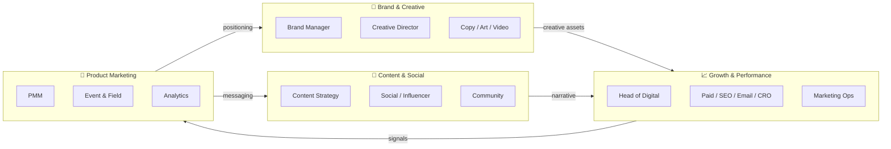

# Marketing Team HQ

> [!QUOTE] **The Manifesto**
> We are not a cost center. We are the compounding engine.
> We don't run campaigns — we engineer inevitability.
> Brand is the interest rate. Performance is the principal. Content is the narrative. Product marketing is the proof.
> Every dollar is an experiment. Every experiment is a lesson. Every lesson is leverage.

---

## 🧭 Start Here

| If you are… | Go to | Then |
|-------------|-------|------|
| A new hire | [[Onboarding]] → [[Culture]] → your role file | Shadow a [[Rituals#Weekly Standup]] in week 1 |
| Running a campaign | [[Workflows#Campaign Launch]] → [[playbooks/Growth-Playbook]] | Grab the [[templates/Campaign-Brief]] |
| In a crisis | [[Workflows#Crisis Communications]] | Page the [[PR-Communications-Director]] — severity first, story second |
| Planning a launch | [[Workflows#Product Launch GTM]] → [[playbooks/Product-Marketing-Playbook]] | Use [[templates/Launch-GTM-Plan]] |
| Writing anything | [[Brand-Manager]] → [[playbooks/Brand-Playbook]] | Run it through the [[Workflows#Brand Approval]] gate |

---

## 🏛️ The Org

```mermaid
flowchart TB
    CEO([CEO])
    CMO([🎖️ CMO])
    CEO --> CMO

    CMO --> VPB([VP Brand Strategy])
    CMO --> VPG([VP Growth & Performance])
    CMO --> VPC([VP Content & Social])
    CMO --> VPP([VP Product Marketing])

    VPB --> BM[Brand Manager]
    VPB --> CD[Creative Director]
    VPB --> PR[PR & Comms Director]
    CD --> SC[Senior Copywriter]
    CD --> AD[Art Director]
    CD --> VPL[Video Production Lead]
    PR --> CMG[Community Manager]

    VPG --> HDM[Head of Digital Marketing]
    VPG --> HAD[Head of Analytics & Data]
    HDM --> SEO[SEO/SEM Specialist]
    HDM --> PMM[Paid Media Manager]
    HDM --> EMM[Email Marketing Manager]
    HDM --> CRO[Conversion Rate Optimizer]
    HDM --> MOM[Marketing Ops Manager]
    HAD --> MDA[Marketing Data Analyst]

    VPC --> CSD[Content Strategy Director]
    VPC --> SMD[Social Media Director]
    CSD --> CW[Content Writer]
    SMD --> SMM[Social Media Manager]
    SMD --> IMM[Influencer Marketing Manager]

    VPP --> PMKT[Product Marketing Manager]
    VPP --> EFM[Event & Field Marketing]

    classDef exec fill:#1a1a2e,stroke:#e94560,stroke-width:3px,color:#fff
    classDef vp fill:#16213e,stroke:#0f3460,stroke-width:2px,color:#fff
    classDef ic fill:#eeeeee,stroke:#333,color:#000
    class CEO,CMO exec
    class VPB,VPG,VPC,VPP vp
    class BM,CD,PR,SC,AD,VPL,CMG,HDM,HAD,SEO,PMM,EMM,CRO,MOM,MDA,CSD,SMD,CW,SMM,IMM,PMKT,EFM ic
```

---

## 🌊 Functional Swim-Lanes

---

## 🎖️ Leadership

| Role | Area | North Star | File |
|------|------|------------|------|
| Chief Marketing Officer | Executive | *Engineer inevitability.* | [[CMO]] |
| VP Brand Strategy | Brand & Creative | *Taste is a responsibility.* | [[VP-Brand-Strategy]] |
| VP Growth & Performance | Acquisition & Revenue | *Compound, don't campaign.* | [[VP-Growth-Performance]] |
| VP Content & Social | Content & Community | *Narrative is the moat.* | [[VP-Content-Social]] |
| VP Product Marketing | Product & GTM | *Make the product undeniable.* | [[VP-Product-Marketing]] |

## 🎨 Brand & Creative

| Role | Level | File |
|------|-------|------|
| Brand Manager | Manager | [[Brand-Manager]] |
| Creative Director | Director | [[Creative-Director]] |
| Senior Copywriter | Senior Specialist | [[Senior-Copywriter]] |
| Art Director | Director | [[Art-Director]] |
| Video Production Lead | Lead | [[Video-Production-Lead]] |

## 📣 Communications

| Role | Level | File |
|------|-------|------|
| PR & Communications Director | Director | [[PR-Communications-Director]] |
| Community Manager | Manager | [[Community-Manager]] |

## 📈 Growth & Performance

| Role | Level | File |
|------|-------|------|
| Head of Digital Marketing | Head | [[Head-Digital-Marketing]] |
| SEO/SEM Specialist | Senior Specialist | [[SEO-SEM-Specialist]] |
| Paid Media Manager | Manager | [[Paid-Media-Manager]] |
| Email Marketing Manager | Manager | [[Email-Marketing-Manager]] |
| Conversion Rate Optimizer | Senior Specialist | [[Conversion-Rate-Optimizer]] |
| Marketing Ops Manager | Manager | [[Marketing-Ops-Manager]] |

## 📊 Analytics & Data

| Role | Level | File |
|------|-------|------|
| Head of Analytics & Data | Head | [[Head-Analytics-Data]] |
| Marketing Data Analyst | Specialist | [[Marketing-Data-Analyst]] |

## 📝 Content & Social

| Role | Level | File |
|------|-------|------|
| Content Strategy Director | Director | [[Content-Strategy-Director]] |
| Content Writer | Specialist | [[Content-Writer]] |
| Social Media Director | Director | [[Social-Media-Director]] |
| Social Media Manager | Manager | [[Social-Media-Manager]] |
| Influencer Marketing Manager | Manager | [[Influencer-Marketing-Manager]] |

## 🚀 Product Marketing

| Role | Level | File |
|------|-------|------|
| Product Marketing Manager | Manager | [[Product-Marketing-Manager]] |
| Event & Field Marketing Manager | Manager | [[Event-Field-Marketing-Manager]] |

---

## 🧬 The Operating System

| Layer | File | Purpose |
|-------|------|---------|
| **Why** | [[Manifesto]] | The creed. Read this first. |
| **How we behave** | [[Culture]] | Values, decisions, disagreement, recognition. |
| **How we grow** | [[Leveling]] | Apprentice → Operator → Architect → Principal. |
| **How we rhythm** | [[Rituals]] | Weekly, monthly, quarterly beats. |
| **How we decide** | [[Decisions]] | DACI matrix for cross-functional calls. |
| **How we start** | [[Onboarding]] | Day 1 → Quarter 1 ramp. |

---

## 📚 Reference

- [[Skills]] — Competency lattice across 8 domains
- [[Tools]] — The stack atlas (data flow + MoSCoW)
- [[Workflows]] — Operational playbooks with RACI and worked examples
- [[KPIs]] — Metrics tree from North Star down to input metrics
- [[Glossary]] — The lexicon, A–W

## 🛠️ Playbooks & Templates

- **Playbooks:** [[playbooks/Brand-Playbook]] · [[playbooks/Growth-Playbook]] · [[playbooks/Content-Playbook]] · [[playbooks/Product-Marketing-Playbook]] · [[playbooks/Analytics-Playbook]] · [[playbooks/Comms-Playbook]] · [[playbooks/Leadership-Playbook]]
- **Templates:** [[templates/Campaign-Brief]] · [[templates/Creative-Brief]] · [[templates/Content-Brief]] · [[templates/Launch-GTM-Plan]] · [[templates/Email-Nurture-Sequence]] · [[templates/CRO-Test-Roadmap]] · [[templates/Crisis-Response-Statement]] · [[templates/Quarterly-Business-Review]] · [[templates/Influencer-Partnership-Brief]] · [[templates/Post-Mortem]]
