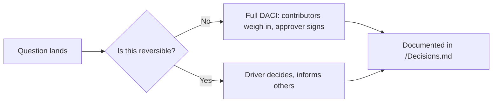

# Culture

> [!QUOTE] **The invisible operating system**
> Org charts show reporting lines. Culture shows how we actually work when no one is watching.

---

## 🧬 Values

### 1. Compounding over heroics
We prize the operator who ships 2% a week over the hero who ships a miracle once. Miracles don't scale.

### 2. Strong opinions, held loosely
Bring conviction to the meeting. Bring humility to the data. Whoever is most right wins — regardless of title.

### 3. Ownership, not territory
You own the outcome, not the turf. If your function is blocking someone else's outcome, you run toward the block, not around it.

### 4. Default to writing
A decision not written down didn't happen. A meeting without notes is nostalgia. We write so the next team can inherit our judgment.

### 5. Speed of trust
We move at the speed we trust each other. That's why we invest in clarity, documentation, and rituals — they're the compound interest of trust.

### 6. Bias to craft
Every artifact — email, slide, dashboard, Slack message — represents the brand. There is no "throwaway" work.

### 7. Respect the maker's time
Meetings are expensive. Deep work is sacred. Tuesdays and Thursdays are meeting-light by default.

---

## 🗳️ How we decide

> [!TIP] **Decision framework**
> Every meaningful decision lives in [[Decisions]] with a clear DACI (Driver · Approver · Contributor · Informed). No DACI, no decision.

- **Two-way doors** → decide fast, document lightly.
- **One-way doors** → full DACI, written rationale, pre-mortem.
- **Disagree and commit** is a feature, not a defeat.

---

## 💬 How we disagree

1. **In the meeting, not after.** Silence in the room + Slack DM after = cultural cancer.
2. **Attack the idea, name the person.** "Your plan has a problem" ≠ "You have a problem."
3. **Bring an alternative.** If you disagree, you owe the team a next-best option.
4. **Escalate early.** A 10-minute escalation saves a 10-day stalemate.
5. **Write it down.** Post-decision, the dissent gets logged — so if we're wrong, we know who saw it coming.

---

## 🏆 How we recognize

> [!NOTE] **Recognition rhythm**
> Recognition is the cheapest, highest-leverage ritual we run. Under-doing it is a management failure.

- **Daily:** Public Slack shout-outs in `#wins` — any teammate, any function.
- **Weekly:** [[Rituals#Weekly Standup]] closes with one peer-to-peer appreciation round.
- **Monthly:** "Compound of the Month" — one operator whose work will still matter in a year.
- **Quarterly:** Craft Awards. Best brief, best campaign, best failure, best cross-functional move.
- **Annually:** Alumni dinner. We celebrate teammates who've left as stewards of the brand.

---

## 🔥 How we handle conflict

- **T+0 (same day):** raise it directly with the person.
- **T+1 (next day):** if unresolved, escalate to the nearest common manager.
- **T+3:** if still unresolved, the [[CMO]] breaks it. Conflict isn't a crime; stagnation is.

---

## 📣 How we communicate

| Channel | Use | Response SLA |
|---------|-----|--------------|
| Slack DM | Quick ask, coordination | Same-day |
| Slack channel | Team-wide updates, decisions | Async |
| Email | External / legal / HR | 24h |
| Notion / Google Doc | Decisions, strategy, briefs | Review within 3 days |
| Meeting | Only for decisions or debate. Not for updates. | Agenda required, notes in 24h |

> [!WARNING] **Channel anti-patterns**
> - *Critical decision buried in a Slack thread at 11pm.* If it's critical, it goes in a doc.
> - *Meeting without an agenda.* Cancel it.
> - *Status update email that could've been a dashboard link.* Automate it.

---

## 🎓 How we onboard

See [[Onboarding]] for the full ramp. Culture highlights:

- **Day 1:** every new hire reads [[Manifesto]] and meets their buddy.
- **Week 1:** shadow three [[Rituals]] across functions.
- **Month 1:** ship a small, visible thing. Small wins bootstrap belonging.
- **Quarter 1:** first retrospective. What surprised you? What should we change?

---

## 🚪 How we exit

- Growth conversations happen **before** performance problems — see [[Leveling]].
- Underperformance gets a plan, not a surprise — 30-day PIP with weekly check-ins.
- When someone leaves, we write a knowledge transfer doc, do a graceful handoff, and wish them loudly well. Alumni become advocates.
- **Never regret who you let go. Always regret how you let them go.**

---

## 🧘 How we rest

- No Slack after 7pm, no email on weekends — unless P1 crisis.
- Minimum 3 consecutive weeks of PTO per year, encouraged.
- "Think Week" twice a year — no meetings, no Slack, deep work only.
- Burnout is a systems failure, not a personal one. If we see it, we fix the system.

---

## Referenced from

- [[Manifesto]] — the why
- [[Leveling]] — the growth path
- [[Rituals]] — the cadence
- [[Decisions]] — the DACI
- [[Onboarding]] — the ramp
