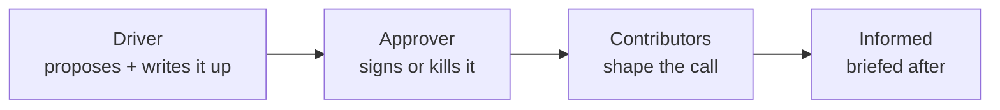

# Decisions

> [!QUOTE] **Clarity over consensus**
> Consensus is not a decision. It's a delay. Every meaningful call in this org has a Driver, an Approver, Contributors, and an Informed list — or it hasn't been made yet.

---

## 🧭 DACI — our decision framework

- **Driver (D):** the one person responsible for moving the decision to a conclusion. Writes the doc.
- **Approver (A):** the one person who says yes or no. Exactly one. No committees.
- **Contributors (C):** the experts whose input is required before the approver decides.
- **Informed (I):** the people who need to know after the decision — not before.

> [!TIP] **Rules of the road**
> - *Reversible decisions* (two-way doors): Driver can decide unilaterally and inform. Document in <24h.
> - *Irreversible decisions* (one-way doors): full DACI, written rationale, 48h pre-mortem review.
> - *Speed bar:* no irreversible decision should stall more than 10 business days. If it does, escalate to [[CMO]].

---

## 📋 The Decision Registry

Below are the 15 most common cross-functional decisions. Every entry links to the workflow or role that operationalizes it.

### 🚀 Campaign & Launch

#### Campaign Go / No-Go
| D | A | C | I |
|---|---|---|---|
| [[Head-Digital-Marketing]] | [[VP-Growth-Performance]] | [[Head-Analytics-Data]], [[Creative-Director]], [[Paid-Media-Manager]] | [[CMO]], all stakeholders |

Reversibility: medium. See [[Workflows#Campaign Launch]].

#### Product Launch T-1 Go / No-Go
| D | A | C | I |
|---|---|---|---|
| [[Product-Marketing-Manager]] | [[VP-Product-Marketing]] | [[CMO]], Product, Sales, [[PR-Communications-Director]] | All hands |

Reversibility: **one-way door**. Pre-mortem required. See [[Workflows#Product Launch GTM]].

#### Kill-switch (mid-flight campaign pause)
| D | A | C | I |
|---|---|---|---|
| [[Paid-Media-Manager]] | [[Head-Digital-Marketing]] | [[Marketing-Data-Analyst]] | All stakeholders |

Reversibility: high. Decision must be <2h when CPA breaches the red line.

---

### 🎨 Brand & Creative

#### Creative Concept Approval
| D | A | C | I |
|---|---|---|---|
| [[Creative-Director]] | [[VP-Brand-Strategy]] | [[Brand-Manager]], [[Senior-Copywriter]], [[Art-Director]] | Requester, [[Head-Digital-Marketing]] |

See [[Workflows#Brand Approval]].

#### Brand Guideline Change
| D | A | C | I |
|---|---|---|---|
| [[Brand-Manager]] | [[VP-Brand-Strategy]] | [[Creative-Director]], [[CMO]] | All marketing, Sales, Product |

Reversibility: **one-way door** once rolled out to the org.

#### Rush Approval Override
| D | A | C | I |
|---|---|---|---|
| Requester | [[VP-Brand-Strategy]] | [[Brand-Manager]] | [[Creative-Director]] |

Rule: no more than 1 rush per week per requesting team.

---

### 📣 Communications

#### Crisis Severity Call (P1 / P2 / P3 / P4)
| D | A | C | I |
|---|---|---|---|
| [[PR-Communications-Director]] | [[CMO]] (P1), [[VP-Brand-Strategy]] (P2), [[PR-Communications-Director]] (P3), [[Community-Manager]] (P4) | [[Social-Media-Director]], [[Community-Manager]] | All stakeholders |

See [[Workflows#Crisis Communications]].

#### Public Statement Release
| D | A | C | I |
|---|---|---|---|
| [[PR-Communications-Director]] | Severity-based | [[Senior-Copywriter]], Legal | All stakeholders |

Reversibility: **one-way door**. Never retracted, only updated.

---

### 📈 Growth & Budget

#### Budget Reallocation (>10% of a channel envelope)
| D | A | C | I |
|---|---|---|---|
| Channel owner | [[VP-Growth-Performance]] | [[Head-Analytics-Data]], [[CMO]] | All VPs |

See [[Rituals#Budget Pulse]].

#### Channel Entry (net new channel investment)
| D | A | C | I |
|---|---|---|---|
| [[Head-Digital-Marketing]] | [[VP-Growth-Performance]] | [[Head-Analytics-Data]], [[Marketing-Ops-Manager]], [[CMO]] | All growth |

Reversibility: medium. Requires 90-day test envelope and kill criteria up front.

#### Channel Exit (retire a channel)
| D | A | C | I |
|---|---|---|---|
| Channel owner | [[VP-Growth-Performance]] | [[Head-Analytics-Data]], [[Head-Digital-Marketing]] | All growth |

Reversibility: **one-way door** in practice (rebuilding a killed channel is 3x the cost).

---

### ⚙️ Ops & Tools

#### New Tool Purchase (>$50k ACV)
| D | A | C | I |
|---|---|---|---|
| [[Marketing-Ops-Manager]] | [[CMO]] | [[Head-Analytics-Data]], tool owner, Finance | All users |

Rule: every new tool needs an *owner*, a *kill trigger*, and a *success metric*. See [[Tools]].

#### Tool Decommission
| D | A | C | I |
|---|---|---|---|
| [[Marketing-Ops-Manager]] | [[CMO]] | Tool owner | All users |

---

### 👥 People

#### Hiring Decision (IC level)
| D | A | C | I |
|---|---|---|---|
| Hiring manager | Skip-level | Interview panel | Team |

#### Hiring Decision (Director+ level)
| D | A | C | I |
|---|---|---|---|
| Hiring manager | [[CMO]] | Skip-level, cross-functional peer | All VPs |

Reversibility: high-cost (bad senior hires take 12–18 months to unwind).

#### Promotion (Director+ level)
| D | A | C | I |
|---|---|---|---|
| Manager (writes case) | [[CMO]] | Skip-level, peer VP | Team |

See [[Leveling]].

#### Termination (performance-based)
| D | A | C | I |
|---|---|---|---|
| Manager | Skip-level + People team | HR, Legal | Required stakeholders only |

Rule: no surprise terminations. 30-day PIP with weekly check-ins precedes every performance exit.

---

## ⚠️ Decision anti-patterns

> [!WARNING] **How decision-making rots**
> - *Consensus-seeking as decision-avoidance.* If the driver needs six signatures, nothing is getting decided.
> - *DACI roles blurred.* Approver and driver are the same person = no check on the call.
> - *Silent dissent.* Nobody pushed back in the meeting; everyone pushed back in DMs afterward.
> - *Decision-by-Slack-scroll.* If it's not in a doc with a DACI, it doesn't count.
> - *Re-litigating after sign-off.* Disagree and commit, or escalate before the call — never undermine after.

---

## Referenced from

- [[00-HOME]] · [[Culture]] · [[Workflows]] · every role's `## 🤝 Collaborates With`
