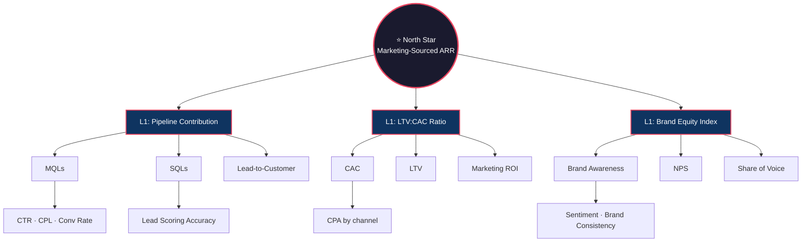

# KPIs & Metrics

> [!QUOTE] **The Metrics Tree**
> One North Star. Three L1s. Everything else rolls up.
> We track what we can change. We report what the board cares about. We optimize what compounds.

---

## 🌳 The Metrics Hierarchy

> [!TIP] **KPI hygiene rules**
> - *Every metric has an owner, a cadence, and a source system.* No orphan numbers on dashboards.
> - *Never optimize inputs in isolation.* CTR up + conversion down = worse, not better.
> - *Ratios over raw counts where possible.* A 20% MoM lift in MQLs with a 30% drop in SQL:MQL is a regression.
> - *Weekly metrics are for operators. Monthly metrics are for managers. Quarterly metrics are for VPs.*

---

## 🎨 Brand

| Metric | Definition | Target | Owner | Source | Cadence |
|--------|-----------|--------|-------|--------|---------|
| Brand Awareness | % of target market that recognizes the brand (aided/unaided) | +5pp YoY | [[Brand-Manager]] | Quarterly survey | Quarterly |
| Brand Sentiment | Net positive vs negative brand mentions | >75% positive | [[PR-Communications-Director]] | Brandwatch | Monthly |
| Share of Voice | Brand mentions vs competitors across channels | >25% category | [[PR-Communications-Director]] | Brandwatch | Monthly |
| Brand Consistency Score | % of assets passing brand guideline audit | >95% | [[Brand-Manager]] | Manual audit | Quarterly |
| NPS (Net Promoter Score) | Customer likelihood to recommend (0-10 scale) | >50 | [[Product-Marketing-Manager]] | Customer survey | Quarterly |

## 🎯 Acquisition

| Metric | Definition | Target | Owner | Source | Cadence |
|--------|-----------|--------|-------|--------|---------|
| Marketing Qualified Leads (MQLs) | Leads meeting scoring threshold | Quarterly plan | [[Head-Digital-Marketing]] | HubSpot | Weekly |
| Sales Qualified Leads (SQLs) | MQLs accepted by sales team | >45% of MQLs | [[Head-Digital-Marketing]] | Salesforce | Weekly |
| Cost Per Lead (CPL) | Total spend / leads generated | <$85 blended | [[Paid-Media-Manager]] | Ad platforms | Weekly |
| Cost Per Acquisition (CPA) | Total spend / customers acquired | <$850 | [[Head-Digital-Marketing]] | Attribution model | Monthly |
| Customer Acquisition Cost (CAC) | Full marketing + sales cost per new customer | <$2,400 | [[CMO]] | Finance + Salesforce | Monthly |
| Lead-to-Customer Rate | % of leads that become paying customers | >3.5% | [[Head-Analytics-Data]] | Salesforce | Monthly |

## 🌐 Digital Performance

| Metric | Definition | Target | Owner | Source | Cadence |
|--------|-----------|--------|-------|--------|---------|
| Website Traffic | Unique visitors, sessions, pageviews | +15% YoY | [[SEO-SEM-Specialist]] | GA4 | Weekly |
| Organic Search Rankings | Position for target keywords | Top 3 for priority kws | [[SEO-SEM-Specialist]] | Semrush | Weekly |
| Click-Through Rate (CTR) | Clicks / impressions across channels | >2.0% paid, >5% organic | [[Paid-Media-Manager]] | Ad platforms + GSC | Weekly |
| Conversion Rate | Conversions / total visitors or clicks | >3.5% site-wide | [[Conversion-Rate-Optimizer]] | GA4 + CRO tool | Weekly |
| ROAS (Return on Ad Spend) | Revenue / ad spend | >4.0x | [[Paid-Media-Manager]] | Ad platforms | Weekly |
| Quality Score | Google Ads quality metric (1-10) | >7 | [[SEO-SEM-Specialist]] | Google Ads | Monthly |

## 📝 Content

| Metric | Definition | Target | Owner | Source | Cadence |
|--------|-----------|--------|-------|--------|---------|
| Content Output | Pieces published per month by type | Editorial plan | [[Content-Strategy-Director]] | CMS | Monthly |
| Organic Traffic Growth | MoM % change in organic sessions | +5% MoM | [[SEO-SEM-Specialist]] | GA4 | Monthly |
| Engagement Rate | (Likes + comments + shares) / reach | >4% | [[Social-Media-Manager]] | Social platforms | Weekly |
| Time on Page | Average seconds spent on content | >2:30 | [[Content-Writer]] | GA4 | Monthly |
| Content Conversion Rate | Content-attributed leads / content visitors | >2% | [[Content-Strategy-Director]] | Attribution model | Monthly |
| Backlinks Acquired | New referring domains per month | >40/month | [[SEO-SEM-Specialist]] | Ahrefs | Monthly |

## ✉️ Email

| Metric | Definition | Target | Owner | Source | Cadence |
|--------|-----------|--------|-------|--------|---------|
| Open Rate | Unique opens / delivered emails | >35% | [[Email-Marketing-Manager]] | ESP | Per send |
| Click-to-Open Rate (CTOR) | Unique clicks / unique opens | >12% | [[Email-Marketing-Manager]] | ESP | Per send |
| List Growth Rate | Net new subscribers per month | +3% MoM | [[Email-Marketing-Manager]] | ESP | Monthly |
| Unsubscribe Rate | Unsubscribes / delivered emails | <0.3% | [[Email-Marketing-Manager]] | ESP | Monthly |
| Email Revenue Attribution | Revenue attributed to email channel | >20% of digital revenue | [[Email-Marketing-Manager]] | Attribution model | Monthly |

## 💬 Social Media

| Metric | Definition | Target | Owner | Source | Cadence |
|--------|-----------|--------|-------|--------|---------|
| Follower Growth | Net new followers across platforms | +8% quarter | [[Social-Media-Manager]] | Sprout Social | Monthly |
| Social Engagement Rate | Total engagements / total followers | >3% | [[Social-Media-Manager]] | Sprout Social | Weekly |
| Social Share of Voice | Brand social mentions vs competitors | >30% category | [[Social-Media-Director]] | Brandwatch | Monthly |
| Social Traffic | Website sessions from social channels | +12% YoY | [[Social-Media-Manager]] | GA4 | Weekly |
| Influencer ROI | Revenue or leads from influencer campaigns | >3x campaign cost | [[Influencer-Marketing-Manager]] | CreatorIQ + attribution | Per campaign |

## 💰 Revenue & ROI

| Metric | Definition | Target | Owner | Source | Cadence |
|--------|-----------|--------|-------|--------|---------|
| Marketing-Sourced Revenue | Revenue from marketing-generated pipeline | Quarterly plan | [[CMO]] | Salesforce | Monthly |
| Marketing-Influenced Revenue | Revenue from deals marketing touched | >70% of closed ARR | [[CMO]] | Attribution model | Monthly |
| Marketing ROI | (Revenue - Cost) / Cost | >5:1 | [[Head-Analytics-Data]] | Finance + Salesforce | Quarterly |
| Pipeline Contribution | % of sales pipeline from marketing | >55% | [[VP-Growth-Performance]] | Salesforce | Monthly |
| LTV:CAC Ratio | Customer lifetime value / acquisition cost | >3:1 | [[Head-Analytics-Data]] | Finance + Salesforce | Quarterly |

## ⚙️ Operations

| Metric | Definition | Target | Owner | Source | Cadence |
|--------|-----------|--------|-------|--------|---------|
| Campaign Velocity | Average days from brief to launch | <21 days | [[Marketing-Ops-Manager]] | Asana | Monthly |
| Tech Stack Utilization | % of licensed tool features actively used | >60% | [[Marketing-Ops-Manager]] | Tool audits | Quarterly |
| Data Quality Score | % of CRM records meeting completeness standards | >90% | [[Marketing-Ops-Manager]] | Salesforce | Monthly |
| Budget Utilization | % of allocated budget spent | 95-102% | [[CMO]] | Finance | Monthly |

---

> [!WARNING] **KPI anti-patterns**
> - *Vanity metrics as success theater.* Impressions without attributable pipeline is noise.
> - *Moving the target after the miss.* Shift the goalposts once; your KPI system is dead.
> - *Owner = "the team".* If everyone owns it, no one owns it.
> - *Metric fatigue.* Dashboards with >15 tiles get skimmed, not read.
