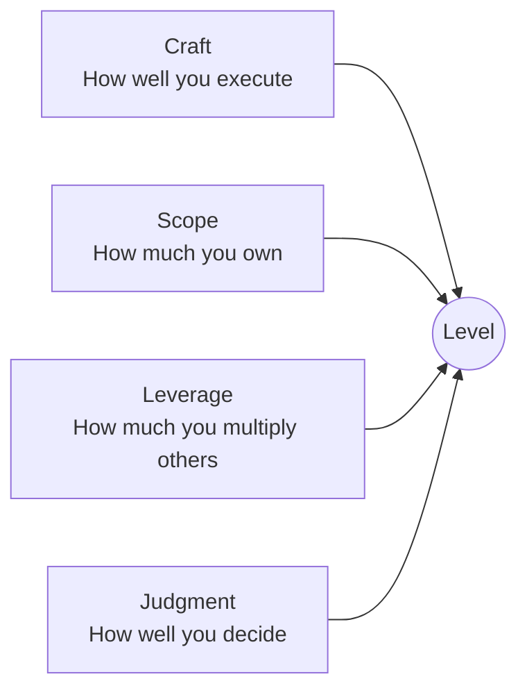

# Leveling

> [!QUOTE] **The growth ladder**
> Career progression is not a secret. Ambiguity is not a motivator — it's a retention killer.
> Levels are defined. Promotions are earned. Mastery is visible.

---

## 🪜 The Four Rungs

Every role in this org maps to one of four levels:

| Level | Scope | Autonomy | Signature Output | Typical Tenure |
|-------|-------|----------|------------------|----------------|
| **Apprentice** | Own a task | Guided | Executes well-defined work end-to-end | 0–18 months |
| **Operator** | Own a domain | Independent within a brief | Owns outcomes for a defined surface | 1.5–4 years |
| **Architect** | Own a system | Sets the brief | Designs how the function works | 3–7 years |
| **Principal** | Own the outcome | Shapes strategy | Cross-functional force multiplier | 6+ years |

---

## 🧬 The Universal Rubric

Every level is assessed on four axes:

### Craft floor per level
- **Apprentice:** ships clean work from a brief.
- **Operator:** ships work that requires judgment within the brief.
- **Architect:** ships the brief itself.
- **Principal:** ships the strategy that shapes briefs for years.

### Scope floor per level
- **Apprentice:** a campaign, a page, a report.
- **Operator:** a channel, a product line, a customer segment.
- **Architect:** a function (Growth, Brand, Content…).
- **Principal:** the P&L.

### Leverage floor per level
- **Apprentice:** your own hours.
- **Operator:** your own hours + 1–2 peers.
- **Architect:** a team of 5–15.
- **Principal:** the org + the market.

### Judgment floor per level
- **Apprentice:** "Which tactic?"
- **Operator:** "Which tactic, for which audience, at what price?"
- **Architect:** "Is this the right channel at all?"
- **Principal:** "Is this the right business?"

---

## 📊 Role × Level Map

| Role | Apprentice | Operator | Architect | Principal |
|------|------------|----------|-----------|-----------|
| [[Brand-Manager]] | — | Brand Manager | Sr Brand Manager | [[VP-Brand-Strategy]] |
| [[Creative-Director]] | — | Associate CD | Creative Director | VP Creative |
| [[Senior-Copywriter]] | Copywriter | Sr Copywriter | Copy Chief | VP Copy |
| [[Art-Director]] | Designer | Art Director | Design Director | VP Design |
| [[Video-Production-Lead]] | Video Producer | Sr Video Producer | Video Production Lead | Head of Video |
| [[PR-Communications-Director]] | PR Specialist | PR Manager | PR Director | VP Comms |
| [[Community-Manager]] | Community Specialist | Community Manager | Community Lead | Head of Community |
| [[Head-Digital-Marketing]] | — | Digital Marketing Mgr | Head of Digital | [[VP-Growth-Performance]] |
| [[SEO-SEM-Specialist]] | SEO Analyst | SEO Specialist | SEO Lead | Head of SEO |
| [[Paid-Media-Manager]] | Paid Media Analyst | Paid Media Manager | Paid Media Director | Head of Paid |
| [[Email-Marketing-Manager]] | Email Specialist | Email Manager | Email Director | Head of Lifecycle |
| [[Conversion-Rate-Optimizer]] | CRO Analyst | CRO Specialist | CRO Lead | Head of CRO |
| [[Marketing-Ops-Manager]] | MOps Analyst | MOps Manager | MOps Director | VP Ops |
| [[Head-Analytics-Data]] | — | Sr Data Analyst | Head of Analytics | VP Data |
| [[Marketing-Data-Analyst]] | Data Analyst | Sr Data Analyst | Analytics Lead | — |
| [[Content-Strategy-Director]] | Content Strategist | Sr Content Strategist | Content Strategy Director | VP Content |
| [[Content-Writer]] | Writer | Sr Writer | Content Lead | — |
| [[Social-Media-Director]] | — | Social Media Mgr | Social Media Director | VP Social |
| [[Social-Media-Manager]] | Social Coordinator | Social Media Manager | Social Lead | — |
| [[Influencer-Marketing-Manager]] | Influencer Specialist | Influencer Manager | Influencer Lead | Head of Creators |
| [[Product-Marketing-Manager]] | Associate PMM | PMM | Sr PMM | [[VP-Product-Marketing]] |
| [[Event-Field-Marketing-Manager]] | Events Coordinator | Events Manager | Field Marketing Director | Head of Field |

---

## 📈 What earns a promotion

> [!TIP] **Three proofs required**
> A promotion requires *three* consecutive quarters of operating at the next level — not one heroic quarter.

1. **Scope proof:** You've owned the next level's scope for 2+ quarters in practice.
2. **Craft proof:** A portfolio artifact (campaign, dashboard, launch, playbook) that demonstrates the next level's bar.
3. **Leverage proof:** Evidence you've made at least one other person on the team better — through mentorship, documentation, or shared process.

The promotion case is co-written by the operator and their manager, reviewed by the skip-level, and signed by the [[CMO]] for Director+ promotions.

---

## 💰 Compensation bands

Compensation bands per level are maintained by the People team and tied to role family + geography. The governance principle:

> [!QUOTE] **Comp philosophy**
> Pay in the 75th percentile of the market. Hire operators who'd be in the 90th percentile anywhere else.

Specific band values are maintained in the People Ops system (not in this repo).

---

## ⚠️ Leveling anti-patterns

> [!WARNING] **What breaks leveling**
> - *Promoting on tenure.* Time in seat ≠ readiness at next level.
> - *Inflating titles to retain.* Fake senior title today = broken ladder tomorrow.
> - *Secret bars.* If the bar isn't written down, it isn't a bar — it's a mood.
> - *Promoting an IC into management to "reward" them.* Management is a different job, not a trophy.

---

## Referenced from

- [[Manifesto]] · [[Culture]] · [[Rituals]] · [[00-HOME]]
- Every role file's `## 📈 Leveling Ladder` section links here.
