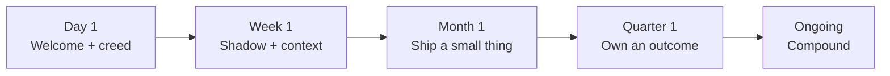

# Onboarding

> [!QUOTE] **The first 90 days**
> A new hire's first week tells them whether to bet their career on us.
> We don't onboard to paperwork. We onboard to belonging, context, and a small, visible win.

---

## 🗓️ The Ramp

---

## 📅 Day 1 — Land

**Goal:** feel welcomed, know where everything is, meet your people.

- **09:00** — Welcome session with manager. Read the [[Manifesto]] aloud together.
- **10:00** — Meet your onboarding buddy (someone *not* your manager, ideally cross-functional).
- **11:00** — Laptop + tool access check. [[Marketing-Ops-Manager]] owns the checklist.
- **12:00** — Team lunch (or async team welcome in Slack for remote).
- **14:00** — Read [[Culture]] and [[Rituals]] end-to-end. Take notes on anything surprising.
- **16:00** — Manager 1:1: align on expectations, buddy, first-week schedule.
- **EOD** — Post a short intro in `#marketing` — who you are, what you love about marketing, one thing you're bad at.

**Artifacts you should have by EOD:** laptop working, Slack on, calendar populated with week-1 shadows, read the Manifesto.

---

## 📅 Week 1 — Absorb

**Goal:** build a map of the org, its rhythms, and its language.

- **Read:** [[00-HOME]] · [[Manifesto]] · [[Culture]] · [[Leveling]] · [[Rituals]] · [[Decisions]] · [[Skills]] · [[Tools]] · [[Workflows]] · [[KPIs]] · [[Glossary]] · **your role file**.
- **Shadow three rituals** outside your immediate team. Write a short reflection in your onboarding doc: *what surprised you? what would you change?*
- **Meet-and-greets:** schedule 30-minute 1:1s with all direct collaborators listed in your role file's `🤝 Collaborates With` table. Ask each: *"What do you wish your last counterpart in my seat had done differently?"*
- **Tools onboarding:** pair with [[Marketing-Ops-Manager]] on the critical tools for your role — see [[Tools]].

**End-of-week artifact:** a 1-page "field notes" doc in Notion. What's the org like? What's confusing? What do you want to fix in 90 days?

---

## 📅 Month 1 — Ship a small thing

**Goal:** earn a tiny, visible win. Ownership bootstraps belonging.

- By end of week 2: manager co-designs a small, scoped deliverable. Criteria:
  - End-to-end ownership
  - Visible to at least one other function
  - Measurable (even qualitatively)
  - Achievable in ≤4 weeks
- By end of week 4: ship the thing. Present a 5-slide mini-retro at your team's [[Rituals#Retro]].

**Examples by role family:**
| Role family | Month-1 small thing |
|-------------|---------------------|
| Growth | Launch a single paid test, report results |
| Content | Publish one pillar blog post |
| Brand | Audit one brand asset category, flag gaps |
| Social | Run a 1-week content pilot on a new format |
| Analytics | Build a single "decision-grade" dashboard tile |
| Product Marketing | Author a battlecard for one competitor |
| Comms | Seed one earned media opportunity |

---

## 📅 Quarter 1 — Own an outcome

**Goal:** you're now a load-bearing member of the team.

- Co-own a real KPI (see [[KPIs]]) with your manager.
- Author one improvement to an existing [[Workflows]] or [[playbooks/Brand-Playbook|playbook]] — an outsider's eye is a gift.
- Complete your first [[Rituals#Retro]] as the *owner*, not the attendee.
- Submit your first 90-day feedback to your manager and skip-level:
  - What surprised you?
  - What's broken?
  - What's worth doubling down on?
  - Would you sign the [[Manifesto]] again today?

---

## 🧭 Manager's onboarding checklist

> [!TIP] **Managers own the ramp**
> The onboarding experience is not HR's job. It's yours. A bad onboarding is 10x the cost of a good one — in trust, retention, and ramp time.

- [ ] Role file updated and accurate before day 1
- [ ] Buddy assigned (not the manager, ideally cross-functional)
- [ ] Calendar pre-populated with week-1 meetings + shadows
- [ ] Tools access provisioned before day 1 ([[Marketing-Ops-Manager]])
- [ ] First small-thing deliverable scoped by end of week 2
- [ ] Weekly 1:1 on the calendar for the first quarter
- [ ] 30-day, 60-day, 90-day check-in on the calendar
- [ ] Written 90-day expectations shared before day 1

---

## 🌱 Buddy's role

- Own the social ramp — introductions, lunch invites, "how we actually work" context.
- Answer the "dumb questions" the new hire won't ask their manager.
- Flag culture drift to the manager if you see the new hire struggling silently.
- Commitment: 30 min/week for the first 6 weeks.

---

## ⚠️ Onboarding anti-patterns

> [!WARNING] **How onboarding fails**
> - *The "throw them in" school.* Week 1 = meetings, no context, no plan. They'll leave before month 3.
> - *No small win in month 1.* Ownership is the fastest path to belonging. Skip it and you've hired a spectator.
> - *Manager absent in week 1.* No amount of Notion docs replaces a manager's attention.
> - *Onboarding treated as "read these docs."* Reading is necessary, not sufficient. Conversations + shadowing + shipping = ramp.

---

## Referenced from

- [[00-HOME]] · [[Culture]] · [[Rituals]] · [[Leveling]] · [[Manifesto]]
