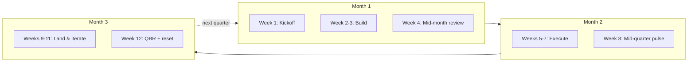

# Rituals

> [!QUOTE] **The cadence of compounding**
> Rhythms are the heartbeat of a team. Skip a beat, lose the tempo.
> Great orgs are 20% strategy and 80% rituals executed well.

---

## 🗓️ The Quarterly Beat

---

## 📅 Daily

### Daily Anomaly Scan
- **When:** 9:00 every weekday
- **Owner:** [[Marketing-Data-Analyst]]
- **Who:** solo, outputs in `#marketing-data`
- **Purpose:** catch KPI anomalies within 24h. See [[Workflows#Performance Review Cycle]].
- **Artifact:** a single Slack message — green / yellow / red per top-10 metric.

---

## 📅 Weekly

### Weekly Standup
- **When:** Monday 9:00, 30 minutes, no exceptions
- **Owner:** rotating across teams
- **Who:** full marketing org (async for distributed time zones)
- **Agenda:**
  1. Top 3 things we shipped last week (90 seconds total)
  2. Top 3 things we'll ship this week (90 seconds total)
  3. One blocker round (anyone can call it)
  4. One recognition round (see [[Culture]])
- **Artifact:** 1-page recap in Notion.

### War Room
- **When:** Wednesday 14:00, 45 minutes
- **Owner:** [[Head-Digital-Marketing]]
- **Who:** growth + analytics + paid + SEO + ops
- **Purpose:** open the dashboard together, attack the worst-performing metric
- **Rule:** no slides, just live data and a decision log.

### Creative Review
- **When:** Thursday 11:00, 60 minutes
- **Owner:** [[Creative-Director]]
- **Who:** [[VP-Brand-Strategy]], [[Senior-Copywriter]], [[Art-Director]], [[Brand-Manager]]
- **Purpose:** approve in-flight creative; protect the brand bar
- **See:** [[Workflows#Brand Approval]]

### Retro
- **When:** Friday 16:00, 45 minutes
- **Owner:** rotating
- **Who:** team that ran the most recent campaign/launch
- **Format:**
  - What worked?
  - What broke?
  - What will we change next week?
- **Artifact:** logged lessons in a retros folder; 1 action item owned by a named person.

---

## 📅 Monthly

### Channel Deep-Dive
- **When:** First Tuesday, 90 minutes per channel
- **Owner:** [[Head-Analytics-Data]] + channel owner
- **Who:** channel team + relevant VP
- **Agenda:**
  1. KPI trends (see [[KPIs]])
  2. What's working / what's breaking
  3. Next-month bet
- **Artifact:** channel performance deck, committed bets.

### Budget Pulse
- **When:** Last Friday, 60 minutes
- **Owner:** [[CMO]] + [[Marketing-Ops-Manager]]
- **Who:** VPs
- **Purpose:** reforecast next month's budget based on pipeline trajectory
- **See:** [[Decisions#Budget Reallocation]]

### Content Editorial Planning
- **When:** Third Wednesday, 90 minutes
- **Owner:** [[Content-Strategy-Director]]
- **Who:** content + SEO + social + PMM
- **Artifact:** next-month editorial calendar.

---

## 📅 Quarterly

### Quarterly Business Review (QBR)
- **When:** Final week of quarter, 3 hours
- **Owner:** [[CMO]]
- **Who:** full marketing org + exec cross-functional
- **Agenda:**
  1. Re-read the [[Manifesto]] (10 min)
  2. Quarter performance vs plan (30 min)
  3. What we learned (45 min)
  4. Next-quarter strategy + budget reallocation (60 min)
  5. Promotions & recognition (30 min)
- **Artifact:** QBR deck, next-quarter OKRs, written lessons.

### Board Review
- **When:** Quarter +2 weeks
- **Owner:** [[CMO]]
- **Who:** Board + CEO
- **Format:** 10-slide deck, 30-minute Q&A
- **See:** [[templates/Quarterly-Business-Review]]

### Craft Awards
- **When:** Quarter +3 weeks (day-long offsite)
- **Owner:** rotating VP
- **Categories:** Best campaign · Best brief · Best dashboard · Best failure · Best cross-functional play · Compound of the Quarter
- **Artifact:** trophies + stories. Told at every future onboarding.

### Skip-Level 1:1s
- **When:** Once per quarter, 30 minutes each
- **Owner:** every VP + [[CMO]] does one round
- **Purpose:** hear signal without the middle manager in the room.

---

## 📅 Annual

### Think Week (x2)
- **When:** Once in Q2, once in Q4
- **Format:** one full week, no meetings, no Slack
- **Purpose:** deep work on a strategic bet, or simply rest
- **Rule:** no one is a "hero" for skipping Think Week.

### Annual Strategy Offsite
- **When:** Q4, 3 days
- **Owner:** [[CMO]]
- **Who:** VPs + Heads
- **Output:** next year's marketing strategy, org design, budget envelope.

### Brand Health Study
- **When:** Q4
- **Owner:** [[Brand-Manager]]
- **Artifact:** year-over-year brand awareness, consideration, preference, NPS.

---

## 🧬 What makes a ritual

Any cadence in this org follows these rules:

1. **Named owner.** "The team" doesn't own anything.
2. **Written agenda.** Sent 24h in advance or the meeting is cancelled.
3. **Time-boxed.** Overrunning a ritual is a failure of facilitation.
4. **Artifact.** If nothing is written down, it didn't happen.
5. **Kill clause.** If a ritual no longer drives a decision, it dies — without ceremony.

---

## ⚠️ Ritual anti-patterns

> [!WARNING] **How rituals rot**
> - *Meetings that are "just a sync."* Replace with a Loom + a dashboard.
> - *Attendance instead of contribution.* If you can't prep, you can't attend.
> - *Rituals that outlive their purpose.* Annual audit; kill 20%.
> - *Agenda of updates instead of decisions.* If there's no decision, it's a newsletter.

---

## Referenced from

- [[00-HOME]] · [[Manifesto]] · [[Culture]] · [[Workflows]] · [[Onboarding]]
- Every role file's `## 🎖️ Rituals & Cadence` section links here.
