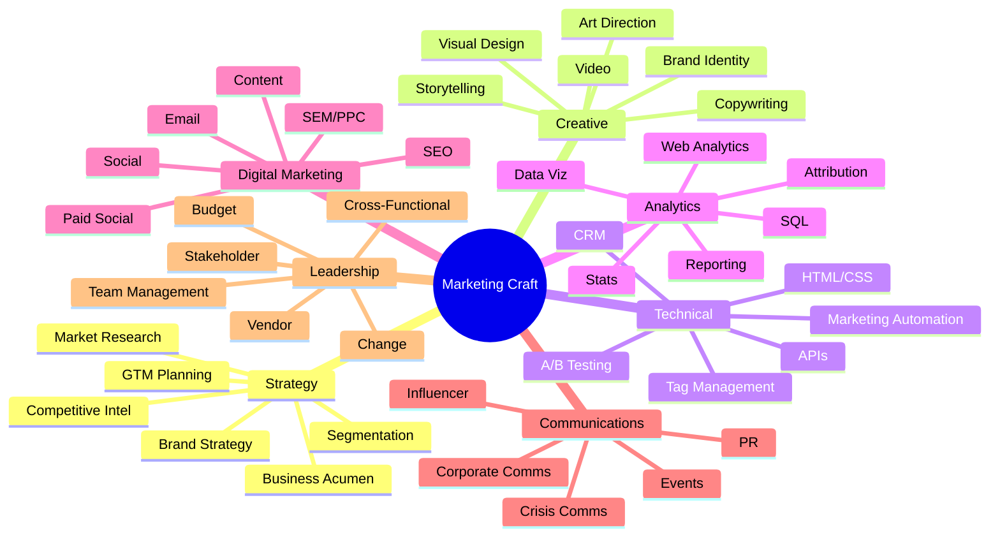

# Skills Catalog

> [!QUOTE] **The Competency Lattice**
> Craft is not a résumé. It's a frequency.
> We hire for edges, not averages — and we level people by what they *ship*, not what they *claim*.

---

## 🌐 The Skill Map

> [!TIP] **How we level skills**
> Every skill has a floor (table below) and a ceiling (principal-grade mastery). See [[Leveling]] for the full rubric and how skills convert to scope, autonomy, and compensation band.

---

## 🧠 Strategy

| Skill | Required For | Level Floor | Assessed By |
|-------|--------------|-------------|-------------|
| Brand Strategy | Positioning, differentiation, brand architecture | Director | [[VP-Brand-Strategy]] |
| Market Research | Qualitative/quantitative research, competitive analysis | Manager | [[Product-Marketing-Manager]] |
| Go-to-Market Planning | Launch strategy, segmentation, messaging frameworks | Manager | [[VP-Product-Marketing]] |
| Business Acumen | P&L understanding, revenue modeling, budget management | Director | [[CMO]] |
| Audience Segmentation | Persona development, TAM/SAM/SOM analysis | Manager | [[Product-Marketing-Manager]] |
| Competitive Intelligence | Market mapping, SWOT, battlecard creation | Manager | [[Product-Marketing-Manager]] |

## 🎨 Creative

| Skill | Required For | Level Floor | Assessed By |
|-------|--------------|-------------|-------------|
| Visual Design | Layout, typography, color theory, brand systems | Specialist | [[Art-Director]] |
| Copywriting | Headlines, long-form, UX copy, tone of voice | Specialist | [[Senior-Copywriter]] |
| Art Direction | Campaign visual concepts, photo/video direction | Director | [[Creative-Director]] |
| Video Production | Scripting, shooting, editing, motion graphics | Specialist | [[Video-Production-Lead]] |
| Brand Identity | Logo systems, style guides, brand books | Manager | [[Brand-Manager]] |
| Storytelling | Narrative structure, emotional hooks, brand narratives | Specialist | [[Creative-Director]] |

## ⚙️ Technical

| Skill | Required For | Level Floor | Assessed By |
|-------|--------------|-------------|-------------|
| Marketing Automation | HubSpot, Marketo, Pardot workflow design | Manager | [[Marketing-Ops-Manager]] |
| CRM Management | Salesforce, HubSpot CRM, pipeline management | Manager | [[Marketing-Ops-Manager]] |
| HTML/CSS | Email templates, landing page customization | Specialist | [[Email-Marketing-Manager]] |
| API Integrations | Zapier, webhooks, data connectors | Manager | [[Marketing-Ops-Manager]] |
| Tag Management | GTM, pixel implementation, event tracking | Specialist | [[Marketing-Ops-Manager]] |
| A/B Testing | Experimentation design, statistical significance | Specialist | [[Conversion-Rate-Optimizer]] |

## 📊 Analytics

| Skill | Required For | Level Floor | Assessed By |
|-------|--------------|-------------|-------------|
| Web Analytics | GA4, Adobe Analytics, attribution modeling | Specialist | [[Marketing-Data-Analyst]] |
| Data Visualization | Looker, Tableau, Power BI, dashboard design | Specialist | [[Head-Analytics-Data]] |
| SQL & Data Querying | Database queries, data extraction | Specialist | [[Head-Analytics-Data]] |
| Statistical Analysis | Regression, cohort analysis, forecasting | Senior Specialist | [[Head-Analytics-Data]] |
| Attribution Modeling | Multi-touch attribution, media mix modeling | Head | [[Head-Analytics-Data]] |
| Reporting | Executive dashboards, weekly/monthly reporting cadences | Specialist | [[Head-Analytics-Data]] |

## 🌐 Digital Marketing

| Skill | Required For | Level Floor | Assessed By |
|-------|--------------|-------------|-------------|
| SEO | Technical SEO, content optimization, link building | Specialist | [[SEO-SEM-Specialist]] |
| SEM/PPC | Google Ads, Bing Ads, bid strategy, quality score | Specialist | [[SEO-SEM-Specialist]] |
| Paid Social | Meta Ads, LinkedIn Ads, TikTok Ads, audience targeting | Manager | [[Paid-Media-Manager]] |
| Email Marketing | Deliverability, segmentation, lifecycle campaigns | Manager | [[Email-Marketing-Manager]] |
| Content Marketing | Editorial planning, content distribution, repurposing | Director | [[Content-Strategy-Director]] |
| Social Media | Platform strategy, community management, social listening | Director | [[Social-Media-Director]] |

## 📣 Communications

| Skill | Required For | Level Floor | Assessed By |
|-------|--------------|-------------|-------------|
| Public Relations | Media relations, press releases, media training | Director | [[PR-Communications-Director]] |
| Crisis Communications | Rapid response, stakeholder messaging | Director | [[PR-Communications-Director]] |
| Corporate Communications | Internal comms, executive comms | Director | [[PR-Communications-Director]] |
| Influencer Relations | Partnership negotiation, campaign management | Manager | [[Influencer-Marketing-Manager]] |
| Event Management | Trade shows, webinars, executive events | Manager | [[Event-Field-Marketing-Manager]] |

## 🎖️ Leadership

| Skill | Required For | Level Floor | Assessed By |
|-------|--------------|-------------|-------------|
| Team Management | Hiring, coaching, performance reviews | Manager | Direct report |
| Cross-functional Collaboration | Working with Sales, Product, Engineering | Manager | Peer VP |
| Stakeholder Management | Executive reporting, board presentations | Director | [[CMO]] |
| Vendor Management | Agency relationships, contract negotiation | Manager | [[Marketing-Ops-Manager]] |
| Budget Management | Forecasting, allocation, ROI optimization | Director | [[CMO]] |
| Change Management | Process improvement, org transformation | VP | [[CMO]] |

---

> [!WARNING] **Skill anti-patterns**
> - *Collecting certifications instead of shipping work.* A dashboard that drove a decision beats a dozen Coursera badges.
> - *Mistaking tool fluency for craft.* Knowing Figma ≠ knowing design.
> - *Broad-and-shallow across domains instead of T-shaped.* Pick one spike, then broaden.
