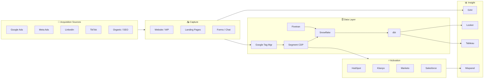

# Marketing Tech Stack

> [!QUOTE] **The Stack Atlas**
> The best stack is the one your team actually uses.
> Tools compound when they talk to each other. They rot when they don't.

---

## 🌊 Data Flow

> [!WARNING] **Integration risk zones**
> - *CDP ↔ CRM sync lag* — >15 min lag breaks real-time personalization.
> - *Tag manager drift* — untested GTM changes silently kill attribution.
> - *Warehouse → BI latency* — stale dashboards = wrong decisions at Monday standup.

---

## 🤝 CRM & Automation

| Tool | MoSCoW | Owner | Cost Tier |
|------|--------|-------|-----------|
| Salesforce | Must | [[Marketing-Ops-Manager]] | $$$$ |
| HubSpot | Must | [[Email-Marketing-Manager]] | $$$ |
| Marketo | Should (enterprise) | [[Marketing-Ops-Manager]] | $$$$ |
| Pardot | Could (SF ecosystem) | [[Marketing-Ops-Manager]] | $$$ |

## 📊 Analytics & BI

| Tool | MoSCoW | Owner | Cost Tier |
|------|--------|-------|-----------|
| Google Analytics 4 | Must | [[Head-Analytics-Data]] | Free |
| Looker | Must | [[Head-Analytics-Data]] | $$$ |
| Tableau | Should | [[Marketing-Data-Analyst]] | $$$ |
| Adobe Analytics | Could | [[Head-Analytics-Data]] | $$$$ |
| Mixpanel | Should | [[Marketing-Data-Analyst]] | $$ |
| Amplitude | Could | [[Marketing-Data-Analyst]] | $$ |

## 📣 Advertising

| Tool | MoSCoW | Owner | Cost Tier |
|------|--------|-------|-----------|
| Google Ads | Must | [[Paid-Media-Manager]] | Variable |
| Meta Ads Manager | Must | [[Paid-Media-Manager]] | Variable |
| LinkedIn Campaign Manager | Must (B2B) | [[Paid-Media-Manager]] | Variable |
| TikTok Ads Manager | Should | [[Paid-Media-Manager]] | Variable |
| DV360 | Could | [[Paid-Media-Manager]] | $$$ |
| The Trade Desk | Could | [[Paid-Media-Manager]] | $$$ |

## 🔍 SEO & Content

| Tool | MoSCoW | Owner | Cost Tier |
|------|--------|-------|-----------|
| Semrush | Must | [[SEO-SEM-Specialist]] | $$ |
| Ahrefs | Should | [[SEO-SEM-Specialist]] | $$ |
| Screaming Frog | Must | [[SEO-SEM-Specialist]] | $ |
| Surfer SEO | Should | [[Content-Writer]] | $ |
| Clearscope | Could | [[Content-Strategy-Director]] | $$ |
| WordPress | Must | [[Content-Writer]] | $ |

## 💬 Social Media

| Tool | MoSCoW | Owner | Cost Tier |
|------|--------|-------|-----------|
| Sprout Social | Must | [[Social-Media-Manager]] | $$ |
| Hootsuite | Could | [[Social-Media-Manager]] | $$ |
| Brandwatch | Should | [[PR-Communications-Director]] | $$$ |
| Later | Could | [[Social-Media-Manager]] | $ |
| CreatorIQ | Should | [[Influencer-Marketing-Manager]] | $$$ |

## ✉️ Email

| Tool | MoSCoW | Owner | Cost Tier |
|------|--------|-------|-----------|
| Klaviyo | Must (DTC) | [[Email-Marketing-Manager]] | $$ |
| Mailchimp | Could | [[Email-Marketing-Manager]] | $ |
| Litmus | Should | [[Email-Marketing-Manager]] | $ |
| Sendgrid | Must | [[Marketing-Ops-Manager]] | $ |

## 🎨 Design & Video

| Tool | MoSCoW | Owner | Cost Tier |
|------|--------|-------|-----------|
| Figma | Must | [[Art-Director]] | $$ |
| Adobe Creative Suite | Must | [[Creative-Director]] | $$$ |
| Canva | Should | [[Brand-Manager]] | $ |
| Frame.io | Must | [[Video-Production-Lead]] | $$ |
| DaVinci Resolve | Should | [[Video-Production-Lead]] | $ |
| After Effects | Must | [[Video-Production-Lead]] | $$ |

## 📋 Project Management

| Tool | MoSCoW | Owner | Cost Tier |
|------|--------|-------|-----------|
| Asana | Must | [[Marketing-Ops-Manager]] | $$ |
| Monday.com | Could | [[Marketing-Ops-Manager]] | $$ |
| Notion | Must | [[CMO]] | $ |
| Slack | Must | All | $$ |
| Miro | Should | [[Creative-Director]] | $ |

## 🤖 AI & Emerging

| Tool | MoSCoW | Owner | Cost Tier |
|------|--------|-------|-----------|
| Claude | Must | All | $ |
| ChatGPT | Should | All | $ |
| Midjourney | Should | [[Art-Director]] | $ |
| Jasper | Could | [[Senior-Copywriter]] | $ |
| Descript | Should | [[Video-Production-Lead]] | $ |
| Eleven Labs | Could | [[Video-Production-Lead]] | $ |

## 🔌 Data & Integration

| Tool | MoSCoW | Owner | Cost Tier |
|------|--------|-------|-----------|
| Zapier | Must | [[Marketing-Ops-Manager]] | $ |
| Segment | Must | [[Head-Analytics-Data]] | $$$ |
| Snowflake | Must | [[Head-Analytics-Data]] | $$$ |
| dbt | Should | [[Head-Analytics-Data]] | $$ |
| Google Tag Manager | Must | [[Marketing-Ops-Manager]] | Free |
| Fivetran | Should | [[Head-Analytics-Data]] | $$ |

---

> [!TIP] **Stack hygiene rituals**
> - Quarterly license audit (owned by [[Marketing-Ops-Manager]]) — kill anything under 20% utilization.
> - Annual renegotiation window — never renew at list price.
> - Every new tool needs an *owner*, a *decommission trigger*, and a *success metric*. No orphan subscriptions.
