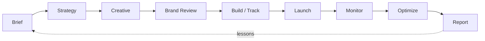
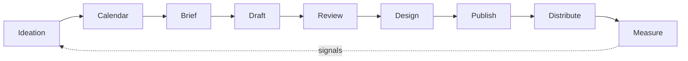
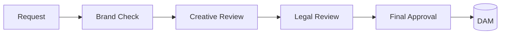
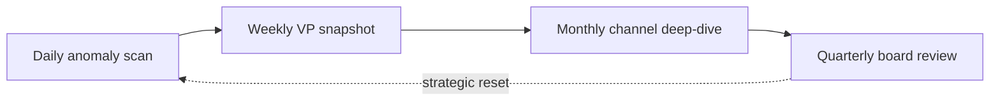
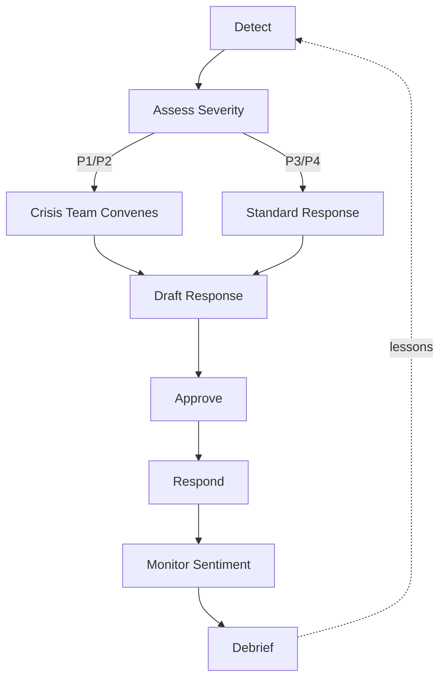
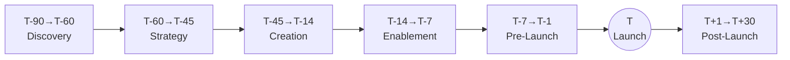

# Core Workflows

> [!QUOTE] **The Operational Playbook**
> Workflows are contracts. They tell us who decides, who does, who delivers, and who learns.
> When a workflow breaks, we don't blame the person — we fix the contract.

---

## 🚀 Campaign Launch

**Owner:** [[Head-Digital-Marketing]]
**Stakeholders:** [[Creative-Director]], [[Content-Strategy-Director]], [[Paid-Media-Manager]], [[Head-Analytics-Data]]

### Flow

### Process
1. **Brief** — [[Product-Marketing-Manager]] or [[Brand-Manager]] submits campaign brief
2. **Strategy** — [[Head-Digital-Marketing]] defines channel mix, budget, timeline
3. **Creative** — [[Creative-Director]] assigns to [[Senior-Copywriter]] + [[Art-Director]]
4. **Review** — [[VP-Brand-Strategy]] approves creative assets
5. **Build** — [[Marketing-Ops-Manager]] sets up tracking, [[Email-Marketing-Manager]] builds sequences
6. **Launch** — [[Paid-Media-Manager]] activates paid, [[Social-Media-Manager]] posts organic
7. **Monitor** — [[Marketing-Data-Analyst]] tracks real-time performance
8. **Optimize** — [[Conversion-Rate-Optimizer]] runs tests, [[Paid-Media-Manager]] adjusts bids
9. **Report** — [[Head-Analytics-Data]] delivers post-campaign analysis

### RACI

| Decision | R | A | C | I |
|----------|---|---|---|---|
| Channel mix & budget | [[Head-Digital-Marketing]] | [[VP-Growth-Performance]] | [[CMO]], [[Paid-Media-Manager]] | All stakeholders |
| Creative concept | [[Creative-Director]] | [[VP-Brand-Strategy]] | [[Brand-Manager]], [[Senior-Copywriter]] | [[Head-Digital-Marketing]] |
| Go / no-go | [[Head-Digital-Marketing]] | [[VP-Growth-Performance]] | [[Head-Analytics-Data]] | [[CMO]] |
| Mid-flight kill switch | [[Paid-Media-Manager]] | [[Head-Digital-Marketing]] | [[Marketing-Data-Analyst]] | All stakeholders |

> [!NOTE] **Worked example — Q3 "Compound" campaign**
> Q3 brief landed on 7/8 with a $1.2M budget across Meta + Google + LinkedIn. Strategy locked 7/12; creative approved 7/22 (one revision loop on hero copy). Launched 8/5. By 8/12 [[Marketing-Data-Analyst]] flagged CPA running 38% over target on LinkedIn; [[Paid-Media-Manager]] reallocated $180k to Meta Retargeting. Final CPA: $184 vs $210 target. Attribution: 4,200 MQLs, 640 SQLs, $3.9M pipeline. Post-campaign review 9/15 — lessons: LinkedIn audience was too broad; next campaign locks ICP filter in the brief.

> [!WARNING] **How this workflow breaks**
> - *Brief arrives without a success metric.* Campaign ships; nobody agrees whether it worked.
> - *Creative review compresses into 48 hours.* Brand approves under pressure; quality drops.
> - *No kill switch owner.* Budget burns past the red line because no single person can stop it.

---

## 📝 Content Pipeline

**Owner:** [[Content-Strategy-Director]]
**Stakeholders:** [[Senior-Copywriter]], [[Content-Writer]], [[SEO-SEM-Specialist]], [[Social-Media-Director]]

### Flow

### Process
1. **Ideation** — Monthly brainstorm with [[Content-Strategy-Director]] + [[SEO-SEM-Specialist]]
2. **Calendar** — [[Content-Strategy-Director]] publishes editorial calendar
3. **Brief** — Individual content briefs with SEO targets from [[SEO-SEM-Specialist]]
4. **Draft** — [[Content-Writer]] or [[Senior-Copywriter]] produces first draft
5. **Review** — [[Content-Strategy-Director]] reviews for quality and strategy fit
6. **Design** — [[Art-Director]] creates visual assets
7. **Publish** — [[Content-Writer]] publishes to CMS
8. **Distribute** — [[Social-Media-Manager]] shares across channels, [[Email-Marketing-Manager]] includes in newsletters
9. **Measure** — [[Marketing-Data-Analyst]] reports on content performance vs [[KPIs#Content]]

### RACI

| Decision | R | A | C | I |
|----------|---|---|---|---|
| Editorial themes | [[Content-Strategy-Director]] | [[VP-Content-Social]] | [[SEO-SEM-Specialist]], [[Product-Marketing-Manager]] | All writers |
| Publish / hold | [[Content-Strategy-Director]] | [[VP-Content-Social]] | [[Brand-Manager]] | Distribution team |
| Distribution channels | [[Social-Media-Director]] | [[VP-Content-Social]] | [[Email-Marketing-Manager]] | [[Content-Strategy-Director]] |

> [!NOTE] **Worked example — "State of the Category" pillar**
> January 2026: a 6,500-word category report ideated in Nov '25. SEO targeted 12 informational queries with combined 40k monthly search volume. Draft took 3 weeks, one major rewrite after [[Product-Marketing-Manager]] flagged positioning drift. Published 1/14, distributed via [[Email-Marketing-Manager]]'s nurture list (220k) and [[Social-Media-Manager]]'s LinkedIn (48k follow). Results at 90 days: 31k organic sessions, 840 MQLs, 12 backlinks from top-tier publications.

> [!WARNING] **How this workflow breaks**
> - *SEO brief and brand voice collide.* Content either ranks or reads well — rarely both.
> - *No distribution owner per piece.* Post-publish silence; 80% of ROI left on the table.
> - *Calendar treated as a suggestion.* Rolling slippage compounds into a missed quarter.

---

## 🛡️ Brand Approval

**Owner:** [[VP-Brand-Strategy]]
**Stakeholders:** [[Brand-Manager]], [[Creative-Director]]

### Flow

### Process
1. **Request** — Any team member submits asset for brand review
2. **Initial Review** — [[Brand-Manager]] checks brand guidelines compliance
3. **Creative Review** — [[Creative-Director]] evaluates creative quality
4. **Legal Review** — Legal team reviews claims, disclaimers (if applicable)
5. **Final Approval** — [[VP-Brand-Strategy]] signs off
6. **Asset Library** — Approved assets uploaded to DAM

### Turnaround
- Standard: 3 business days
- Rush: 1 business day (requires VP approval)

### RACI

| Decision | R | A | C | I |
|----------|---|---|---|---|
| Brand guideline pass | [[Brand-Manager]] | [[VP-Brand-Strategy]] | [[Creative-Director]] | Requester |
| Creative quality | [[Creative-Director]] | [[VP-Brand-Strategy]] | [[Senior-Copywriter]], [[Art-Director]] | Requester |
| Final sign-off | [[VP-Brand-Strategy]] | [[CMO]] | Legal | All stakeholders |

> [!WARNING] **How this workflow breaks**
> - *Approval by Slack thread.* Decision lost in scrollback; asset relaunches with the wrong cut.
> - *Legal invoked too late.* Claim rewritten 4 hours before launch; creative loses the edge.
> - *Rush becomes default.* Every asset is "urgent"; nothing gets the review it deserves.

---

## 📊 Performance Review Cycle

**Owner:** [[Head-Analytics-Data]]
**Stakeholders:** [[CMO]], all VPs

### Cadence

- **Daily** — [[Marketing-Data-Analyst]] monitors dashboards, flags anomalies
- **Weekly** — [[Head-Analytics-Data]] shares performance snapshot with VPs
- **Monthly** — Deep-dive by channel with [[Head-Digital-Marketing]], [[Content-Strategy-Director]], [[Social-Media-Director]]
- **Quarterly** — [[CMO]] presents board-level marketing review with [[Head-Analytics-Data]]

### Deliverables
- Weekly email digest with [[KPIs]] trends
- Monthly channel performance decks
- Quarterly business review presentation

### RACI

| Decision | R | A | C | I |
|----------|---|---|---|---|
| KPI definitions | [[Head-Analytics-Data]] | [[CMO]] | All VPs | All managers |
| Escalate anomaly | [[Marketing-Data-Analyst]] | [[Head-Analytics-Data]] | Relevant channel owner | [[CMO]] |
| Budget reallocation | VP of affected area | [[CMO]] | [[Head-Analytics-Data]] | All VPs |

> [!NOTE] **Worked example — the Thursday CAC spike**
> March 2026: daily dashboard showed blended CAC jumping 23% on a Thursday. [[Marketing-Data-Analyst]] escalated within 2 hours. Root cause: a Meta audience pixel broke after a GTM change. [[Marketing-Ops-Manager]] rolled back the tag; CAC normalized by Friday morning. Cost of 18-hour latency: ~$42k in wasted spend. Fixed process: all GTM changes now require dual sign-off.

> [!WARNING] **How this workflow breaks**
> - *Dashboards nobody reads.* Anomalies accumulate silently; monthly review becomes an archaeology dig.
> - *Weekly snapshot as CC-all email.* No narrative, no decisions, just numbers.
> - *Quarterly QBR as theater.* Strategy questions deferred; operators learn nothing changed.

---

## 🚨 Crisis Communications

**Owner:** [[PR-Communications-Director]]
**Stakeholders:** [[CMO]], [[VP-Brand-Strategy]], [[Community-Manager]], [[Social-Media-Director]]

### Severity Levels
| Level | Description | Response Time | Approver |
|-------|-------------|---------------|----------|
| P1 — Critical | Brand reputation at risk, viral negative press | 1 hour | [[CMO]] |
| P2 — High | Significant social media backlash, product issue | 4 hours | [[VP-Brand-Strategy]] |
| P3 — Medium | Negative press coverage, customer complaints | 24 hours | [[PR-Communications-Director]] |
| P4 — Low | Minor social mentions, routine corrections | 48 hours | [[Community-Manager]] |

### Flow

### Process
1. **Detect** — [[Community-Manager]] or [[Social-Media-Manager]] flags issue
2. **Assess** — [[PR-Communications-Director]] determines severity level
3. **Assemble** — Crisis team convenes (based on severity)
4. **Draft** — [[PR-Communications-Director]] + [[Senior-Copywriter]] draft response
5. **Approve** — Appropriate approver signs off
6. **Respond** — Coordinated response across relevant channels
7. **Monitor** — [[Community-Manager]] tracks sentiment shift
8. **Debrief** — Post-crisis review and lessons learned

### RACI

| Decision | R | A | C | I |
|----------|---|---|---|---|
| Severity call | [[PR-Communications-Director]] | [[CMO]] | [[VP-Brand-Strategy]] | All stakeholders |
| Public statement | [[PR-Communications-Director]] | Severity-based approver | [[Senior-Copywriter]], Legal | All stakeholders |
| Channel response matrix | [[Social-Media-Director]] | [[PR-Communications-Director]] | [[Community-Manager]] | [[CMO]] |

> [!WARNING] **How this workflow breaks**
> - *Severity inflation.* Every P3 gets treated as a P1; crisis fatigue sets in.
> - *Silence as strategy.* 12 hours without a statement reads as guilt.
> - *Apology without action.* Statement ships; nothing changes; trust compounds downward.

---

## 🚢 Product Launch GTM

**Owner:** [[Product-Marketing-Manager]]
**Stakeholders:** [[VP-Product-Marketing]], [[Creative-Director]], [[Head-Digital-Marketing]], [[PR-Communications-Director]], [[Content-Strategy-Director]]

### Timeline (T = Launch Day)

| Phase | Timeline | Activities |
|-------|----------|------------|
| Discovery | T-90 to T-60 | Market research, competitive analysis, positioning |
| Strategy | T-60 to T-45 | Messaging framework, channel strategy, budget |
| Creation | T-45 to T-14 | Assets, content, landing pages, email sequences |
| Enablement | T-14 to T-7 | Sales training, internal comms, partner briefing |
| Pre-launch | T-7 to T-1 | Teaser campaigns, media outreach, influencer seeding |
| Launch | T-Day | Coordinated multi-channel launch |
| Post-launch | T+1 to T+30 | Performance tracking, optimization, iteration |

### RACI

| Decision | R | A | C | I |
|----------|---|---|---|---|
| Positioning & messaging | [[Product-Marketing-Manager]] | [[VP-Product-Marketing]] | [[Brand-Manager]], Product team | [[CMO]] |
| Launch date | [[Product-Marketing-Manager]] | [[VP-Product-Marketing]] | Product, Sales, [[CMO]] | All stakeholders |
| Go / no-go (T-1) | [[VP-Product-Marketing]] | [[CMO]] | All workstream leads | All hands |
| Post-launch pivot | [[Product-Marketing-Manager]] | [[VP-Product-Marketing]] | [[Head-Analytics-Data]] | All stakeholders |

> [!NOTE] **Worked example — "Aurora" platform launch**
> Q4 '25: Aurora launched after 90-day ramp. Discovery flagged a positioning risk against an incumbent; messaging reframed from "faster" to "compounds faster." Pre-launch seeded 40 analysts and 12 creators. Launch day: 3 paid channels live, 4-piece content drop, CEO keynote. T+7 results: 12k signups (target: 8k), 2.1% activation (below 3% target). T+14 pivot: onboarding email flow rewritten; activation climbed to 3.4%. Debrief lesson: activation workstream was under-resourced pre-launch.

> [!WARNING] **How this workflow breaks**
> - *Launch date set before positioning locks.* Team builds assets on sand.
> - *Sales enablement treated as a deck, not a conversation.* AEs fumble the pitch week one.
> - *No post-launch owner.* Launch week = celebration, week two = silence, month two = quiet death.
