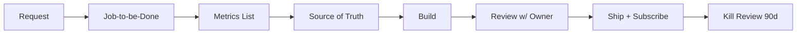
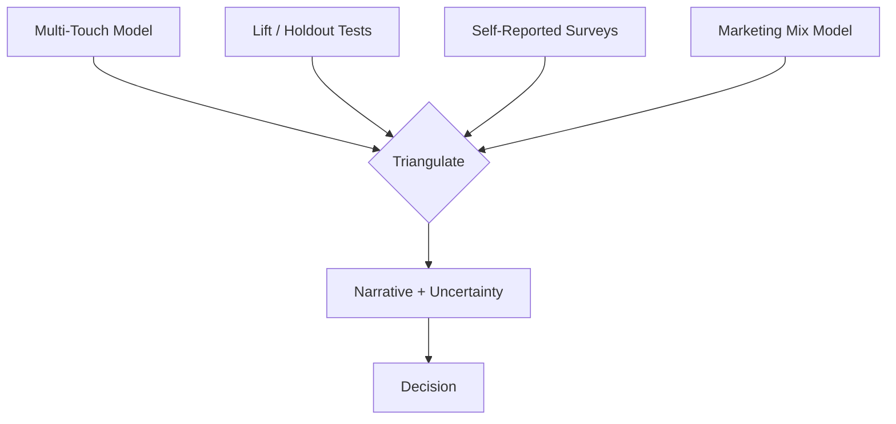
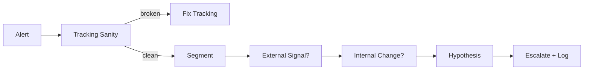
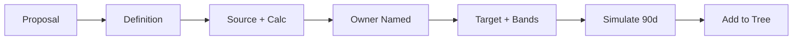
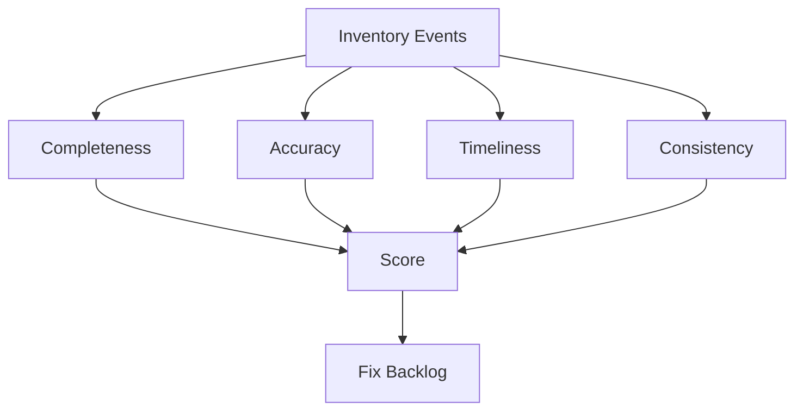

# Analytics Playbook

> [!QUOTE] **The Creed**
> *Data decides. Judgment directs. We refuse to be data-paralyzed or vibe-driven.*

---

## 🧭 When to use this playbook

| Scenario | Trigger | Start with |
|----------|---------|------------|
| Building a new dashboard | Stakeholder request, quarterly plan | Play: *The Dashboard Discipline* |
| Attribution debate opens | Teams disagree on channel credit | Play: *The Attribution Triangulation* |
| Anomaly detected | Daily monitor flags outlier | Play: *The Anomaly Triage* |
| New KPI proposed | Planning cycle, exec request | Play: *The KPI Ratification* |
| Data integrity concern | Tracking change, pixel break, schema drift | Play: *The Data Quality Audit* |

---

## 🎯 Core Principles

1. **One source of truth per metric.** If two dashboards disagree, one of them has to die.
2. **Instrument before you spend.** Tracking after launch is an archaeology dig.
3. **Every metric has an owner.** Orphan metrics go stale; stale metrics lie.
4. **Correlation is not causation — but it's not nothing.** We triangulate: MTA, lift tests, holdouts, MMM.
5. **Bad news fast.** A CAC spike found on day 2 costs 14× less than one found on day 14.
6. **The dashboard is the byproduct, not the product.** Decisions are the product.
7. **Measure the learning, not just the launch.** A failed experiment that teaches is a better asset than a successful one that can't be explained.

---

## 🛠️ The Plays

### Play 1 — The Dashboard Discipline

**When to use:** Any new dashboard request, or when an existing one goes unread for 30 days.

1. [[Marketing-Data-Analyst]] captures the dashboard's job: what decision does it enable?
2. List 5–7 metrics max; anything else is noise.
3. Confirm source of truth for each metric with [[Head-Analytics-Data]].
4. Build with annotations, not just charts — context is the product.
5. Review with the decision-owner; they sign off or the dashboard dies.
6. Ship with a subscription — owners see it weekly without asking.
7. At 90 days, if nobody opened it, kill it.

**Success metric:** ≥ 80% of shipped dashboards survive the 90-day kill review.

---

### Play 2 — The Attribution Triangulation

**When to use:** Quarterly, or when a channel's claimed contribution strains credibility.

1. Run the default MTA model — know its bias (last-click inflation, view-through overcredit).
2. Pair with incrementality: geo holdouts, PSA tests, ghost bids where possible.
3. Add self-reported attribution at conversion — "how did you hear about us?"
4. For strategic channels, run or commission an MMM annually.
5. Publish the triangulated view with uncertainty ranges, not a single number.
6. Commit to one model for decisioning — acknowledge the others inform it.
7. Re-validate quarterly; adjust the narrative, not the identity.

**Success metric:** Channel credit decisions survive two consecutive quarterly reviews.

---

### Play 3 — The Anomaly Triage

**When to use:** Daily. Any metric outside control bands.

1. Alert fires — [[Marketing-Data-Analyst]] acknowledges within 2 hours.
2. First check: is tracking intact? Pixel, GTM, UTM, server events.
3. Segment the anomaly: channel, geo, device, creative, cohort.
4. Rule out external signals: platform changes, seasonality, PR spikes.
5. Rule out internal changes: new creative, LP update, policy deploy.
6. Form one-line hypothesis; escalate to channel owner.
7. Log every anomaly — patterns become monitors.

Reference: [[Workflows#Performance Review Cycle]] for the worked example.
**Success metric:** Median time-to-diagnose < 24 hours.

---

### Play 4 — The KPI Ratification

**When to use:** Any new KPI proposed for team, VP, or board use.

1. Sponsor writes a one-page proposal: what decision does this metric drive?
2. Precise definition — numerator, denominator, time window, exclusions.
3. Source of truth, calculation logic, refresh cadence.
4. Name a single accountable owner.
5. Set target and acceptable variance bands.
6. Backtest against 90 days of history — does it move when reality moved?
7. Add to the [[KPIs]] tree with its parent and children identified.

**Success metric:** No KPI ratified without an owner, a target, and a historical backtest.

---

### Play 5 — The Data Quality Audit

**When to use:** Monthly, and after any tracking or schema change.

1. [[Marketing-Ops-Manager]] inventories every tracked event and identifier.
2. Score completeness — % of expected events firing.
3. Score accuracy — reconcile marketing to finance monthly.
4. Score timeliness — data latency against SLA.
5. Score consistency — same question, two systems, same answer.
6. Publish the scorecard; fix critical gaps before any launch.
7. Gate GTM changes on dual sign-off (the Thursday CAC rule).

Reference: [[templates/Post-Mortem]].
**Success metric:** Data quality score ≥ 95%; zero material reconciliation gaps with finance.

---

## ⚠️ Anti-Patterns

> [!WARNING] **How analytics programs fail**
> - *Dashboards nobody reads.* Anomalies accumulate silently; monthly review becomes an archaeology dig.
> - *Attribution wars as identity wars.* Teams defend models instead of agreeing on imperfect truth.
> - *Vanity metrics in board decks.* Impressions and likes crowd out pipeline and LTV.
> - *Tracking added after launch.* First week's data is lost forever.
> - *Anomaly alerts with no owner.* Alarms fire into the void.
> - *Data paralysis.* Waiting for certainty past the point where action was cheap.

---

## 📊 Success Metrics

| Metric | Category | Target signal |
|--------|----------|---------------|
| Data quality score | [[KPIs#Operations]] | ≥ 95% |
| Dashboard utilization | [[KPIs#Operations]] | ≥ 80% opened weekly |
| Time-to-diagnose anomaly | [[KPIs#Operations]] | Median < 24h |
| Attribution confidence interval | [[KPIs#Revenue & ROI]] | Narrowing QoQ |
| KPI tree coverage | [[KPIs#Operations]] | 100% of North Stars traced to inputs |
| Marketing-to-finance reconciliation | [[KPIs#Revenue & ROI]] | < 2% variance |

---

## 🔗 Related

- **Roles:** [[CMO]] · [[VP-Growth-Performance]] · [[Head-Analytics-Data]] · [[Marketing-Data-Analyst]] · [[Marketing-Ops-Manager]] · [[Head-Digital-Marketing]]
- **Workflows:** [[Workflows#Performance Review Cycle]] · [[Workflows#Campaign Launch]]
- **Rituals:** [[Rituals#Weekly Standup]] · [[Rituals#Channel Deep-Dive]] · [[Rituals#Budget Pulse]] · [[Rituals#Quarterly Business Review]]
- **Decisions:** [[Decisions#Budget Reallocation]] · [[Decisions#Campaign Go / No-Go]]
- **Templates:** [[templates/Quarterly-Business-Review]] · [[templates/Post-Mortem]] · [[templates/CRO-Test-Roadmap]]
