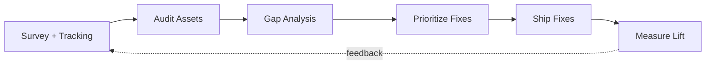
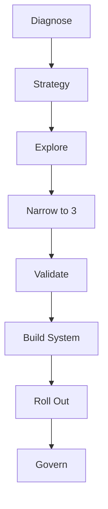
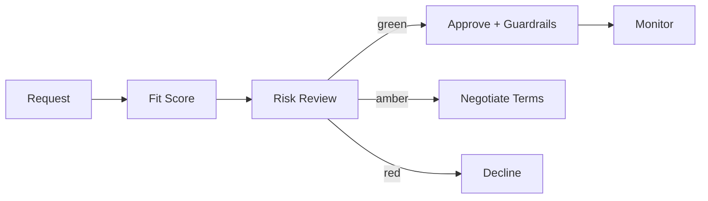
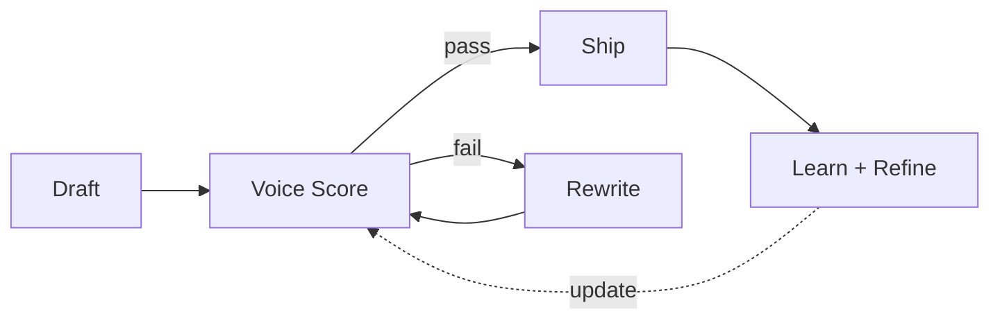

# Brand Playbook

> [!QUOTE] **The Creed**
> *Brand is the interest rate on every dollar we spend. We don't protect it — we compound it.*

---

## 🧭 When to use this playbook

| Scenario | Trigger | Start with |
|----------|---------|------------|
| New campaign needs brand review | Creative in draft, launch within 14 days | [[Workflows#Brand Approval]] |
| Identity or voice drift detected | QBR flags brand health dip, social sentiment softens | Play: *The Brand Audit* |
| Rebrand or visual refresh underway | Board-approved initiative, 60+ day scope | Play: *The Identity Refresh* |
| Sub-brand, product family, or region launching | New SKU or market with distinct audience | Play: *The Architecture Decision* |
| Partner, sponsorship, or co-marketing request | External logo adjacency proposal | Play: *The Co-Brand Gate* |

---

## 🎯 Core Principles

1. **Taste is a responsibility.** We ship work that raises the category's floor. The bar is *undeniable*, not *acceptable*.
2. **Consistency compounds, novelty decays.** A recognizable mark, voice, and rhythm beat a clever one-off every quarter.
3. **The brief is sacred.** No asset gets built without an audience, outcome, deadline, and success metric. See [[Workflows#Campaign Launch]].
4. **Brand lives in the seams.** The onboarding email, the 404 page, the out-of-office reply — those are the brand. Hero campaigns are the smallest part.
5. **Every approval is a vote.** We say no to protect the yes. Ambiguity is expensive.
6. **The system outlasts the campaign.** Guidelines, DAM, and tokens do more work than any single hero ad.
7. **Measure equity, not applause.** Awareness, consideration, and preference — not likes, impressions, or internal excitement.

---

## 🛠️ The Plays

### Play 1 — The Brand Audit

**When to use:** Quarterly, or when brand-health KPIs drift two consecutive weeks.

1. Pull the last 90 days of brand-tracking data from [[Head-Analytics-Data]].
2. Sample 40 live assets across web, paid, email, social, and sales decks.
3. Score each against guidelines (voice, identity, accessibility, legal).
4. Map gaps to root cause — missing template, missing training, missing approval.
5. Stack-rank fixes by reach × equity risk.
6. Ship the top five within 30 days; the rest flow through [[Workflows#Brand Approval]].
7. Re-measure at 60 days; publish delta to [[CMO]] and [[VP-Brand-Strategy]].

Reference: [[templates/Post-Mortem]] for the audit write-up.
**Success metric:** Brand consistency score (sampled) ≥ 90%; unaided awareness flat or up.

---

### Play 2 — The Identity Refresh

**When to use:** Strategy pivot, M&A, or every 4–6 years when the system starts to feel dated.

1. Diagnose: quantitative tracker + qualitative interviews with customers, sales, employees.
2. Write the brief — audience, tension, promise, behavior change. One page.
3. Explore 8–12 directions with [[Creative-Director]]; kill fast.
4. Narrow to three; validate with a customer panel and the executive team.
5. Build the system — logo, typography, color tokens, motion, voice guardrails.
6. Roll out in waves (internal → digital → paid → print) per the [[Workflows#Brand Approval]] flow.
7. Govern: publish the new guidelines, retrain every requester, lock DAM to new tokens.

Reference: [[templates/Creative-Brief]].
**Success metric:** 100% of new work ships on the new system within 90 days of launch. See [[KPIs#Brand]].

---

### Play 3 — The Co-Brand Gate

**When to use:** Any partner, sponsorship, influencer deal, or integration where our mark sits next to another.

1. Partner request enters via [[Brand-Manager]].
2. Score fit: audience overlap, values alignment, equity direction.
3. Risk review with Legal and [[PR-Communications-Director]].
4. Set guardrails: logo lockups, approval rights, exit clauses.
5. Document the co-brand kit; upload to DAM.
6. Review every 90 days; auto-renew only on performance thresholds.

Reference: [[templates/Influencer-Partnership-Brief]].
**Success metric:** 0 brand-safety incidents; partner-attributed lift ≥ program cost.

---

### Play 4 — The Voice Enforcement Loop

**When to use:** Continuous. Activates on every piece of copy shipping to market.

1. Every draft passes through the voice rubric (clarity, cadence, courage, craft).
2. [[Senior-Copywriter]] owns calibration; [[Brand-Manager]] spot-checks 10% weekly.
3. Failures return with one concrete rewrite example, not a vibe note.
4. Log every rejection reason — patterns become training updates.
5. Quarterly, the top three rejection patterns become mandatory workshops.

Reference: [[templates/Content-Brief]].
**Success metric:** First-pass approval rate trending up quarter over quarter.

---

## ⚠️ Anti-Patterns

> [!WARNING] **How brand stewardship fails**
> - *Guidelines as PDF, not as system.* Nobody reads a 120-page deck; they copy the last asset that shipped.
> - *Approval by vibes.* "I'll know it when I see it" means the team reworks three times and still ships late.
> - *Brand as veto, not as partner.* If the brand team only says no, the organization routes around it.
> - *Refresh without retrain.* New logo on old templates in old decks — the refresh dies in month two.
> - *Co-brand creep.* One partner logo becomes ten; the mark loses gravity.
> - *Measuring applause, not equity.* Internal love ≠ customer preference.

---

## 📊 Success Metrics

| Metric | Category | Target signal |
|--------|----------|---------------|
| Unaided brand awareness | [[KPIs#Brand]] | +2pp QoQ in priority segments |
| Brand consistency score | [[KPIs#Brand]] | ≥ 90% on sampled assets |
| Share of voice | [[KPIs#Brand]] | ≥ #2 in category |
| NPS / brand preference | [[KPIs#Brand]] | +3 QoQ |
| Creative first-pass approval | [[KPIs#Operations]] | ≥ 70% |
| Brand-attributed organic traffic | [[KPIs#Content]] | Compounding 5%+ MoM |

---

## 🔗 Related

- **Roles:** [[CMO]] · [[VP-Brand-Strategy]] · [[Brand-Manager]] · [[Creative-Director]] · [[Senior-Copywriter]] · [[Art-Director]]
- **Workflows:** [[Workflows#Brand Approval]] · [[Workflows#Campaign Launch]] · [[Workflows#Product Launch GTM]]
- **Rituals:** [[Rituals#Weekly Standup]] · [[Rituals#Retro]] · [[Rituals#Quarterly Business Review]]
- **Decisions:** [[Decisions#Creative Concept Approval]] · [[Decisions#Campaign Go / No-Go]]
- **Templates:** [[templates/Creative-Brief]] · [[templates/Campaign-Brief]] · [[templates/Content-Brief]] · [[templates/Influencer-Partnership-Brief]] · [[templates/Post-Mortem]]
