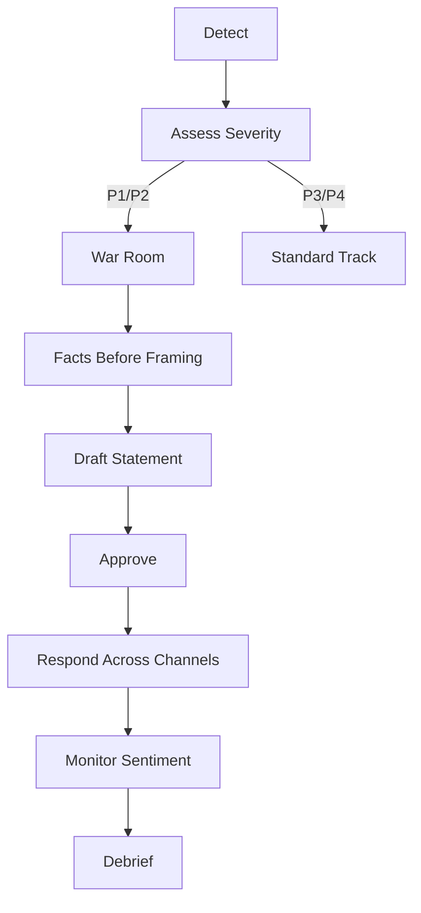
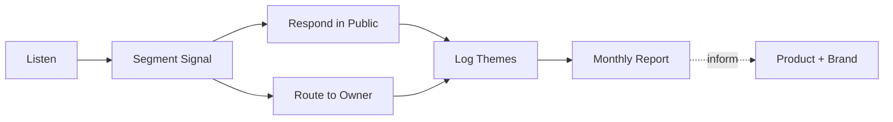
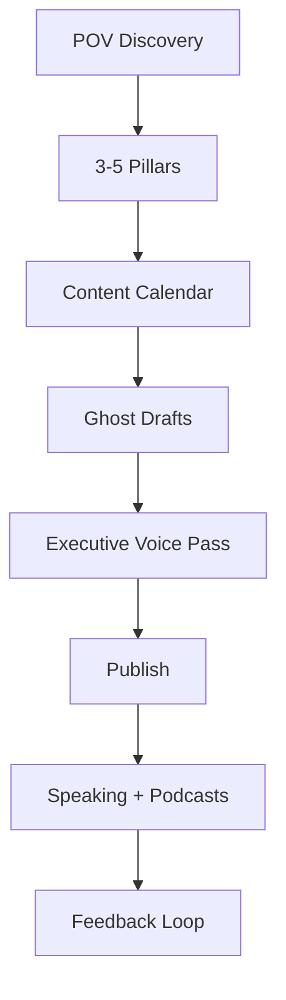
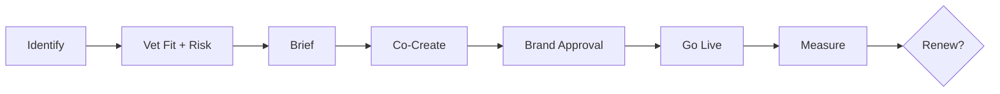

# Comms Playbook

> [!QUOTE] **The Creed**
> *Trust is built in public and lost in private. We show up early, speak plainly, and remember who we serve.*

---

## 🧭 When to use this playbook

| Scenario | Trigger | Start with |
|----------|---------|------------|
| Crisis signal detected | Negative viral content, product incident, leak | [[Workflows#Crisis Communications]] |
| Earned-media opportunity | Launch, milestone, data story, executive POV | Play: *The Earned Media Machine* |
| Community heat rising | Sentiment shift, mod queue growing, creator backlash | Play: *The Community Pulse* |
| Executive platform building | CEO/CMO thought leadership initiative | Play: *The Executive Narrative* |
| Influencer or creator partnership | Paid or gifted collaboration ≥ material value | Play: *The Creator Collab* |

---

## 🎯 Core Principles

1. **Silence is a statement.** 12 hours without a reply reads as guilt.
2. **Severity before story.** We classify first, then write. See [[Decisions#Crisis Severity Call]].
3. **One voice, many mouths.** Every external reply ladders back to one approved posture.
4. **Community is a two-way contract.** We listen more than we broadcast.
5. **Apology without action is noise.** The statement ships with a change attached.
6. **Earned media is not free.** It costs relationships, originality, and patience.
7. **Reputation compounds — both ways.** Every interaction is a deposit or a withdrawal.

---

## 🛠️ The Plays

### Play 1 — The Crisis Response

**When to use:** Any P1 or P2 severity signal per [[Workflows#Crisis Communications]].

1. [[Community-Manager]] or [[Social-Media-Manager]] flags; [[PR-Communications-Director]] classifies within 1 hour.
2. Convene war room per severity. See [[Rituals#War Room]].
3. Establish facts — what is true, what is suspected, what is unknown.
4. Draft with [[Senior-Copywriter]]: acknowledge, explain, commit, contact.
5. Approve per severity matrix; log decision with timestamp.
6. Respond in coordinated waves across owned, earned, and paid surfaces.
7. Monitor sentiment for 72 hours; debrief at 7 days; publish lessons.

Reference: [[templates/Crisis-Response-Statement]].
**Success metric:** Sentiment returns to baseline within 14 days; zero secondary crises from the response itself.

---

### Play 2 — The Earned Media Machine

**When to use:** Launches, data releases, research drops, executive POVs.

1. Start from the story the reader would click — not the story we want to tell.
2. Tier the list: outlets where we can win, outlets we'd trade for, outlets we must have.
3. Decide posture: exclusive, embargo, broad outreach. Each serves a different relationship.
4. Pitch with a one-page angle, not a press release.
5. Brief spokespeople with three messages and one memorable line.
6. Amplify published pieces via owned channels and sales.
7. Follow up: thank the reporter, send the next useful data point, build the long relationship.

**Success metric:** ≥ 1 tier-1 placement per quarter; share of voice holding or growing. See [[KPIs#Brand]].

---

### Play 3 — The Community Pulse

**When to use:** Continuous. Deeper review monthly or when sentiment shifts.

1. [[Community-Manager]] monitors owned forums, social, review sites, Discord/Slack.
2. Segment signals: question, complaint, compliment, crisis seed.
3. Respond publicly where it helps the next reader, not just the asker.
4. Route operational issues to product, support, or sales — with SLA.
5. Log recurring themes weekly; quantify monthly.
6. Publish the pulse to [[VP-Brand-Strategy]] and [[VP-Product-Marketing]].
7. Close the loop publicly when a community-driven change ships.

**Success metric:** Time-to-first-reply < 1 hour in business hours; sentiment trending positive. See [[KPIs#Social Media]].

---

### Play 4 — The Executive Narrative

**When to use:** Building thought leadership for CEO, [[CMO]], or other principals.

1. Discover the executive's real POV through interviews — not their LinkedIn bio.
2. Lock 3–5 narrative pillars that only they can credibly own.
3. Build a 90-day calendar across owned and earned surfaces.
4. Ghost draft, then executive voice pass — the words are theirs, the production is ours.
5. Publish on a predictable rhythm; consistency builds audience.
6. Layer in podcast, stage, and media to compound reach.
7. Measure: followers are vanity; inbound opportunities are the real signal.

Reference: [[templates/Content-Brief]].
**Success metric:** Inbound earned-media requests and speaking invites compound QoQ.

---

### Play 5 — The Creator Collab

**When to use:** Any paid or gifted partnership with a creator or influencer.

1. [[Influencer-Marketing-Manager]] identifies candidates by audience overlap and authenticity signals.
2. Vet: brand safety history, audience quality, past performance, values alignment.
3. Brief with outcomes and guardrails — not a script.
4. Co-create — the creator's instinct on format beats our instinct on control.
5. Run through [[Workflows#Brand Approval]] for claims and legal.
6. Go live; measure reach, engagement, and attributed conversion.
7. Renew only on performance and relationship thresholds.

Reference: [[templates/Influencer-Partnership-Brief]].
**Success metric:** Partner-attributed CAC ≤ blended CAC; zero brand-safety incidents. See [[KPIs#Acquisition]].

---

## ⚠️ Anti-Patterns

> [!WARNING] **How communications programs fail**
> - *Severity inflation.* Every P3 becomes a P1; crisis fatigue sets in; real crises get missed.
> - *Apology without action.* Statement ships; nothing changes; trust compounds downward.
> - *PR as press releases.* Outlets ignore; internal theater continues.
> - *Executive ghostwriting without voice.* Posts read like the marketing team, not the human.
> - *Community managed as a queue.* Reactive mode only; themes never reach product.
> - *Creator deals on vibes.* No brief, no guardrails, no measurement — just hope.

---

## 📊 Success Metrics

| Metric | Category | Target signal |
|--------|----------|---------------|
| Share of voice | [[KPIs#Brand]] | Holding or growing vs category |
| Tier-1 media placements | [[KPIs#Brand]] | ≥ 1 per quarter |
| Community sentiment | [[KPIs#Social Media]] | Trending positive MoM |
| Time-to-first-reply | [[KPIs#Social Media]] | < 1 hour in business hours |
| Crisis recovery time | [[KPIs#Brand]] | Sentiment to baseline < 14 days |
| Creator-attributed conversion | [[KPIs#Acquisition]] | CAC ≤ blended |

---

## 🔗 Related

- **Roles:** [[CMO]] · [[VP-Brand-Strategy]] · [[PR-Communications-Director]] · [[Community-Manager]] · [[Social-Media-Director]] · [[Social-Media-Manager]] · [[Influencer-Marketing-Manager]] · [[Senior-Copywriter]]
- **Workflows:** [[Workflows#Crisis Communications]] · [[Workflows#Brand Approval]] · [[Workflows#Content Pipeline]]
- **Rituals:** [[Rituals#Weekly Standup]] · [[Rituals#War Room]] · [[Rituals#Retro]]
- **Decisions:** [[Decisions#Crisis Severity Call]] · [[Decisions#Creative Concept Approval]]
- **Templates:** [[templates/Crisis-Response-Statement]] · [[templates/Influencer-Partnership-Brief]] · [[templates/Content-Brief]] · [[templates/Post-Mortem]]
