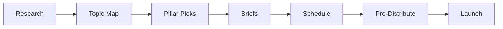
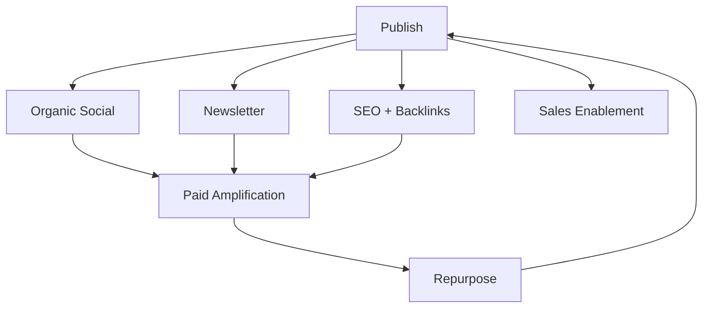
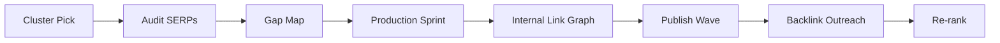
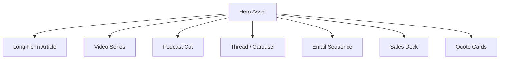
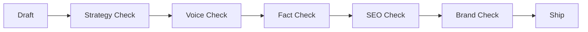

# Content Playbook

> [!QUOTE] **The Creed**
> *Distribution eats creation for breakfast. We plan the audience before we greenlight the asset.*

---

## 🧭 When to use this playbook

| Scenario | Trigger | Start with |
|----------|---------|------------|
| Planning next quarter's editorial | 45 days before quarter start | Play: *The Pillar Plan* |
| New piece entering the pipeline | Brief submitted, draft not started | [[Workflows#Content Pipeline]] |
| Organic traffic plateau | 60 days flat or declining | Play: *The Topical Authority Raid* |
| Asset performing well — amplifying | CTR or engagement 2x baseline | Play: *The Distribution Flywheel* |
| Repurposing existing IP | Hero piece > 30 days old, still relevant | Play: *The Atomization Engine* |

---

## 🎯 Core Principles

1. **Narrative is the moat.** Anyone can buy an ad; only we can tell our story.
2. **Write for one reader.** Content aimed at everyone lands on no one.
3. **SEO and taste are not enemies.** The best content ranks *because* it's undeniable.
4. **One piece, ten assets.** If we ship a pillar without a distribution plan, we shipped a liability.
5. **The calendar is the product.** Consistency builds the audience; brilliance merely rewards them.
6. **Measure the compound.** Sessions, subscribers, organic pipeline — not likes.
7. **Show the work.** Primary research, original data, and strong opinions beat summaries every time.

---

## 🛠️ The Plays

### Play 1 — The Pillar Plan

**When to use:** Quarterly planning; defines 3–5 category-defining pieces.

1. [[Content-Strategy-Director]] pulls search, social, and sales signals.
2. Map topics by business impact × search opportunity × authority gap.
3. Pick 3–5 pillars per quarter; everything else orbits them.
4. Write briefs with [[SEO-SEM-Specialist]] — intent, competitors, format, success metric.
5. Schedule drafts, design, legal, launch in [[Workflows#Content Pipeline]].
6. Pre-distribute: brief the sales team, email list, and three influencers *before* publish.
7. Launch with a coordinated drop — email + social + paid boost.

Reference: [[templates/Content-Brief]].
**Success metric:** Each pillar drives ≥ 2x category-average organic sessions at 90 days. See [[KPIs#Content]].

---

### Play 2 — The Distribution Flywheel

**When to use:** Every published piece, no exceptions.

1. On publish, [[Social-Media-Manager]] executes the social drop per channel playbook.
2. [[Email-Marketing-Manager]] places in the nearest newsletter slot.
3. [[SEO-SEM-Specialist]] triggers backlink and internal-link strategy.
4. [[Product-Marketing-Manager]] pushes into sales enablement where relevant.
5. Top 20% by week-1 engagement get paid amplification.
6. Week 4: repurpose winners into new formats (thread, video, carousel, podcast).
7. Month 2: refresh, re-syndicate, or retire.

**Success metric:** Distribution multiplier ≥ 5 derivative assets per pillar. See [[KPIs#Social Media]].

---

### Play 3 — The Topical Authority Raid

**When to use:** When a topic cluster is winnable within 2 quarters.

1. Pick a topic cluster where we rank #8–20 and intent aligns with buyer journey.
2. Audit top 10 SERPs — format, depth, recency, backlink profile.
3. Map the gap: what do we have the authority or data to say that they can't?
4. Produce 6–10 pieces in a sprint (one hub, many spokes).
5. Build the internal link graph before publish, not after.
6. Run targeted backlink outreach with [[PR-Communications-Director]].
7. Re-evaluate rank at 60 and 120 days.

Reference: [[templates/Content-Brief]].
**Success metric:** Cluster-level organic sessions 3x within 2 quarters. See [[KPIs#Content]].

---

### Play 4 — The Atomization Engine

**When to use:** Any pillar, keynote, webinar, or report worth more than one format.

1. [[Content-Strategy-Director]] commits the atomization map *before* the hero ships.
2. Extract data points, quotes, hot takes during drafting — not after.
3. Assign each derivative to an owner with a ship date.
4. Sequence the drops over 4–8 weeks, not one frantic week.
5. Each derivative links back to the hero for authority compounding.
6. Measure which formats convert; weight next pillar's map accordingly.

**Success metric:** ≥ 7 derivative assets per hero; aggregate reach ≥ 3x hero-only baseline.

---

### Play 5 — The Editorial Quality Bar

**When to use:** Every draft, non-negotiable.

1. Strategy: does this serve a pillar and a defined reader?
2. Voice: does it sound like us, not like the internet?
3. Fact: every claim cited; every stat traced to primary source.
4. SEO: title, H1, meta, internal links, schema.
5. Brand: pass [[Workflows#Brand Approval]] where assets or claims require it.
6. Ship — or send back with one specific rewrite, not a vague note.

**Success metric:** First-pass approval ≥ 70%; zero published factual corrections.

---

## ⚠️ Anti-Patterns

> [!WARNING] **How content programs fail**
> - *Publishing without a distribution owner.* The piece ships; 80% of the value leaks.
> - *SEO ghostwriting.* Thin posts optimized for robots; readers bounce; rankings eventually follow.
> - *Calendar treated as aspirational.* Slippage compounds into a missed quarter.
> - *Hero campaigns that never atomize.* One shot, no follow-up, no compounding.
> - *Ranking without revenue.* Top-of-funnel traffic with no bridge to pipeline.
> - *Trend-chasing.* Every topic is "AI"; the brand loses a point of view.

---

## 📊 Success Metrics

| Metric | Category | Target signal |
|--------|----------|---------------|
| Organic sessions | [[KPIs#Content]] | Compounding MoM |
| Content-sourced pipeline | [[KPIs#Content]] | ≥ 20% of inbound pipeline |
| Newsletter subscribers | [[KPIs#Email]] | Net-new growth MoM |
| Engagement rate by channel | [[KPIs#Social Media]] | Above category benchmark |
| Backlinks from DR ≥ 60 sites | [[KPIs#Content]] | ≥ 5 per pillar |
| Time-to-publish (brief → live) | [[KPIs#Operations]] | Trending down |

---

## 🔗 Related

- **Roles:** [[VP-Content-Social]] · [[Content-Strategy-Director]] · [[Content-Writer]] · [[Senior-Copywriter]] · [[Social-Media-Director]] · [[Social-Media-Manager]] · [[SEO-SEM-Specialist]] · [[Influencer-Marketing-Manager]]
- **Workflows:** [[Workflows#Content Pipeline]] · [[Workflows#Brand Approval]] · [[Workflows#Campaign Launch]]
- **Rituals:** [[Rituals#Weekly Standup]] · [[Rituals#Channel Deep-Dive]] · [[Rituals#Retro]]
- **Decisions:** [[Decisions#Creative Concept Approval]]
- **Templates:** [[templates/Content-Brief]] · [[templates/Creative-Brief]] · [[templates/Email-Nurture-Sequence]] · [[templates/Influencer-Partnership-Brief]] · [[templates/Post-Mortem]]
