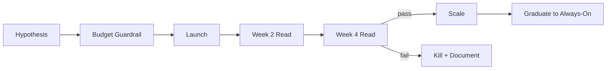
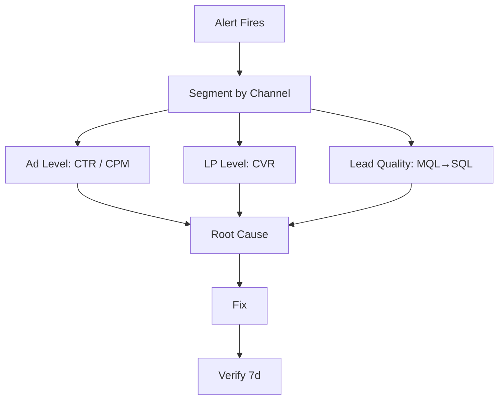
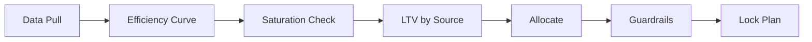
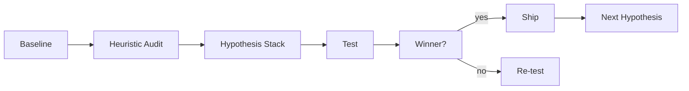
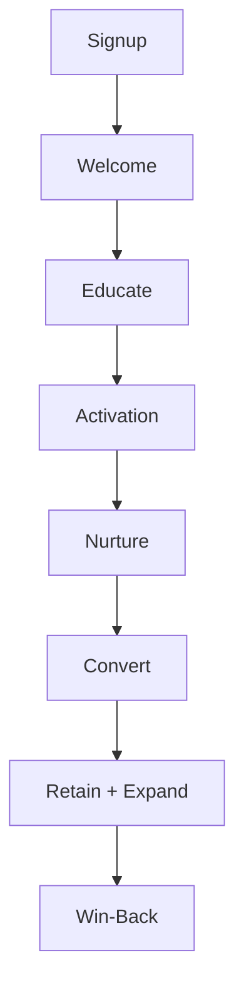

# Growth Playbook

> [!QUOTE] **The Creed**
> *We don't buy customers. We engineer a channel system where each dollar teaches the next.*

---

## 🧭 When to use this playbook

| Scenario | Trigger | Start with |
|----------|---------|------------|
| New channel under evaluation | Paid or organic experiment outside current mix | Play: *The Channel Probe* |
| CAC rising without pipeline lift | Weekly digest flags 2+ consecutive increases | Play: *The CAC Diagnostic* |
| Planning next quarter's budget | 30 days before quarter end | Play: *The Portfolio Allocation* |
| Landing page or flow underperforms | Conversion rate below cohort baseline | Play: *The Conversion Sprint* |
| Paid creative fatigue hits | CTR decay >20% over 14 days | Play: *The Creative Refresh Loop* |

---

## 🎯 Core Principles

1. **Every dollar is an experiment.** If we can't explain why we spent it, we shouldn't have spent it.
2. **Compound, don't campaign.** A channel that improves 2% weekly beats a channel that spikes quarterly.
3. **CAC is a portfolio.** Blended is a distraction; channel-level CAC against channel-level LTV is the truth.
4. **Attribution is a theory, not a fact.** We triangulate — MTA, lift tests, surveys, MMM — and we disclose the uncertainty.
5. **Creative is a growth lever.** The best targeting can't save a bad hook; the best hook can't save a broken landing page.
6. **Speed beats perfection in diagnosis, rigor beats speed in commitment.** Kill fast, scale slow.
7. **The funnel is one organism.** Winning a click we can't convert is a tax, not a win.

---

## 🛠️ The Plays

### Play 1 — The Channel Probe

**When to use:** Before any new channel gets past $10k/month.

1. [[Paid-Media-Manager]] writes a one-page hypothesis: audience, creative angle, CPA ceiling, decision date.
2. [[Head-Digital-Marketing]] approves a capped test budget (usually 2–4 weeks of CAC × target volume).
3. Build tracking with [[Marketing-Ops-Manager]] before the first dollar ships.
4. Launch; hold creative and targeting constant for two weeks — no mid-test "fixes."
5. Week 2 read: pace to CPA? If >150% of ceiling, kill. Otherwise continue.
6. Week 4 read: CAC, lead quality, downstream pipeline. Scale only if all three trend right.
7. Document in the channel log — kept or killed, learning always.

Reference: [[templates/Campaign-Brief]].
**Success metric:** ≥ 30% of probes graduate to always-on at target CAC. See [[KPIs#Digital Performance]].

---

### Play 2 — The CAC Diagnostic

**When to use:** Blended CAC up 10%+ WoW, or any channel past its ceiling.

1. [[Marketing-Data-Analyst]] slices CAC by channel, campaign, creative, and geo.
2. Decompose: is it CPM up, CTR down, CVR down, or lead quality down?
3. Check for platform-side signals (iOS changes, auction shifts, policy flags).
4. Confirm tracking integrity — the Thursday CAC spike is often a pixel issue. See [[Workflows#Performance Review Cycle]].
5. Identify the lever: creative swap, bid strategy, audience, LP, or offer.
6. Ship one change; verify for 7 days before stacking the next.
7. Post-mortem if CAC move >15% in either direction.

Reference: [[templates/Post-Mortem]].
**Success metric:** Time-to-diagnose < 24h, time-to-fix < 72h.

---

### Play 3 — The Portfolio Allocation

**When to use:** Quarterly, or when a channel shifts >2x in efficiency.

1. Pull 90 days of spend, CAC, and LTV by channel from [[Head-Analytics-Data]].
2. Plot marginal CAC by channel (the last dollar, not the average).
3. Flag saturated channels (marginal CAC ≥ 1.5× average).
4. Reallocate from saturated → under-invested where LTV supports.
5. Reserve 10–15% for exploration under the *Channel Probe* play.
6. Set kill-switch thresholds with [[VP-Growth-Performance]].
7. Review in the [[Rituals#Budget Pulse]].

Reference: [[Decisions#Budget Reallocation]].
**Success metric:** Blended CAC payback ≤ target months. See [[KPIs#Acquisition]].

---

### Play 4 — The Conversion Sprint

**When to use:** A key page or flow underperforms cohort baseline by 15%+.

1. [[Conversion-Rate-Optimizer]] sets the baseline and names the success metric (one).
2. Heuristic audit: clarity, friction, trust, incentive, speed.
3. Stack hypotheses by impact × confidence × ease; top three enter the test roadmap.
4. Run tests at proper power — no peeking, no early calls.
5. Ship winners; document losers with the why.
6. Re-audit quarterly; page decays like creative.

Reference: [[templates/CRO-Test-Roadmap]].
**Success metric:** ≥ 1 shipped winner per sprint, cumulative CVR lift compounding. See [[KPIs#Digital Performance]].

---

### Play 5 — The Email Lifecycle Engine

**When to use:** Continuous. Any time a lead or customer state changes.

1. [[Email-Marketing-Manager]] maps every lifecycle state to a trigger.
2. Write sequences with [[Senior-Copywriter]] — one job per email, one CTA.
3. Instrument cohort metrics: open, click, reply, conversion, revenue per send.
4. A/B continuously on subject, hook, CTA — never more than one variable.
5. Audit deliverability monthly; cull dead contacts to protect the sender.
6. Graduate winning sequences into the always-on machine.

Reference: [[templates/Email-Nurture-Sequence]].
**Success metric:** Email-attributed revenue compounds MoM. See [[KPIs#Email]].

---

## ⚠️ Anti-Patterns

> [!WARNING] **How growth programs fail**
> - *Blended CAC as the only KPI.* Masks which channels pay for themselves and which are freeloading.
> - *Scaling a winner without a ceiling.* Every channel saturates; ignoring it wastes the next quarter.
> - *Creative treated as a deliverable, not a lever.* Agencies ship one hero asset; performance dies on week three.
> - *Optimization theater.* Daily dashboard-staring with no hypothesis.
> - *Landing pages owned by nobody.* Paid drives traffic into a 2021 page and blames the channel.
> - *Attribution wars.* Teams argue over models instead of agreeing on one imperfect truth and acting on it.

---

## 📊 Success Metrics

| Metric | Category | Target signal |
|--------|----------|---------------|
| Blended CAC | [[KPIs#Acquisition]] | Flat-to-down with volume up |
| Channel-level CAC payback | [[KPIs#Acquisition]] | < target months |
| MQL → SQL conversion | [[KPIs#Acquisition]] | ≥ baseline + quality |
| Paid ROAS | [[KPIs#Digital Performance]] | Above portfolio floor |
| Landing page CVR | [[KPIs#Digital Performance]] | Compounding QoQ |
| Email-attributed revenue | [[KPIs#Email]] | MoM compounding |
| LTV:CAC | [[KPIs#Revenue & ROI]] | ≥ 3:1 |

---

## 🔗 Related

- **Roles:** [[CMO]] · [[VP-Growth-Performance]] · [[Head-Digital-Marketing]] · [[Paid-Media-Manager]] · [[SEO-SEM-Specialist]] · [[Email-Marketing-Manager]] · [[Conversion-Rate-Optimizer]] · [[Marketing-Ops-Manager]] · [[Head-Analytics-Data]]
- **Workflows:** [[Workflows#Campaign Launch]] · [[Workflows#Performance Review Cycle]]
- **Rituals:** [[Rituals#Weekly Standup]] · [[Rituals#Channel Deep-Dive]] · [[Rituals#Budget Pulse]] · [[Rituals#War Room]]
- **Decisions:** [[Decisions#Budget Reallocation]] · [[Decisions#Campaign Go / No-Go]]
- **Templates:** [[templates/Campaign-Brief]] · [[templates/Email-Nurture-Sequence]] · [[templates/CRO-Test-Roadmap]] · [[templates/Post-Mortem]]
