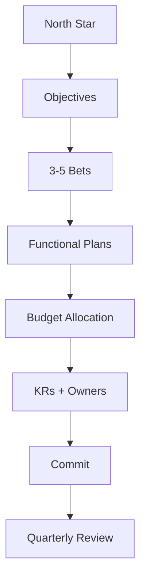
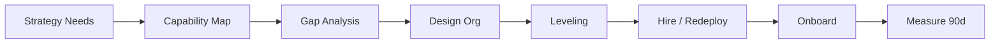
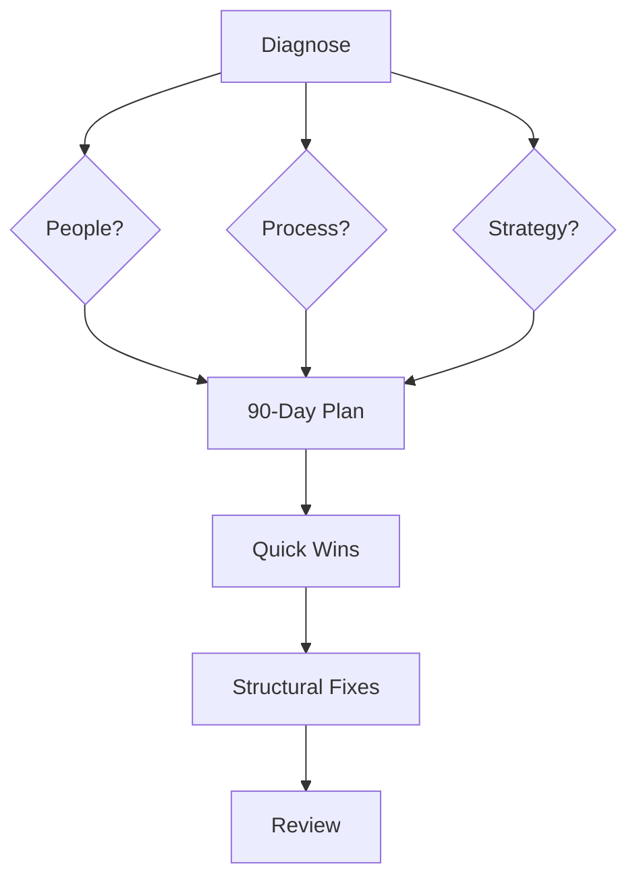
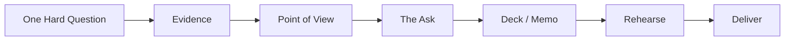
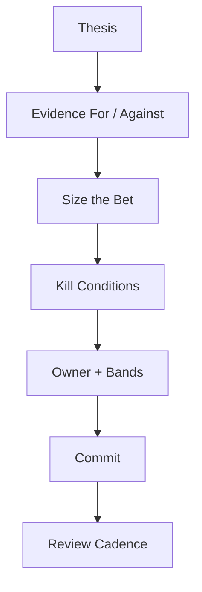

# Leadership Playbook

> [!QUOTE] **The Creed**
> *A marketing leader's job is bets, not tickets. We decide, we delegate, we defend the compounding.*

---

## 🧭 When to use this playbook

| Scenario | Trigger | Start with |
|----------|---------|------------|
| Annual or quarterly planning | 45 days before period start | Play: *The Planning Cascade* |
| Hiring or restructuring the team | Headcount plan, capability gap, attrition | Play: *The Org Design Loop* |
| A function is underperforming | Two consecutive quarters below target | Play: *The Turnaround Protocol* |
| Board or exec comms | QBR, board prep, strategic ask | Play: *The Executive Narrative* |
| Strategic bet under consideration | Material spend or market move | Play: *The Bet Framework* |

---

## 🎯 Core Principles

1. **Manage the strategy, not the tickets.** If a leader is the bottleneck on execution, the org is under-leveled.
2. **Disagree in the meeting. Commit in the launch.** Dissent dies when the decision lands.
3. **Hire for edge, not polish.** A safe senior team produces safe marketing.
4. **The P&L is a point of view.** Every allocation is a bet about the future; defend the thesis, not the line item.
5. **Protect the compounding.** Short-term pressure will always come for the brand and the calendar; the leader's job is to shield them.
6. **Coach the next layer, not the ICs.** Leaders grow leaders.
7. **Bad news, early and unvarnished.** A leader who never delivers bad news has stopped looking.

---

## 🛠️ The Plays

### Play 1 — The Planning Cascade

**When to use:** Annual and quarterly. Sets strategy, budget, and bets.

1. [[CMO]] re-anchors the North Star against company strategy.
2. Frame 3–5 bets — not twenty priorities. Each bet has a thesis and a kill condition.
3. Cascade to VPs; each function plans against the bets, not around them.
4. Allocate budget top-down by bet, then bottom-up by function; reconcile in one meeting.
5. Lock KRs and owners per bet — no orphan objectives.
6. Commit publicly; the manifesto governs; dissent ended at commitment.
7. Review quarterly — cut losers fast, double down on winners. See [[Rituals#Quarterly Business Review]].

Reference: [[templates/Quarterly-Business-Review]].
**Success metric:** ≥ 60% of bets hit or exceed target; killed bets documented within 30 days.

---

### Play 2 — The Org Design Loop

**When to use:** Annually, at scale inflection, or when capability gaps bind strategy.

1. Start from strategy — what capabilities must exist 12 months from now?
2. Map current capabilities against the [[Skills]] lattice; score depth and redundancy.
3. Identify gaps: build, buy, or borrow?
4. Design roles before people; pressure-test against [[Leveling]] rubric.
5. Level existing team honestly — promote, hold, or coach-out.
6. Hire with a scorecard; onboard per [[Onboarding]]; assign a 30-60-90.
7. Measure ramp and contribution at 90 days; iterate the design.

**Success metric:** Key capability coverage ≥ 2 deep; regrettable attrition < 8% annual.

---

### Play 3 — The Turnaround Protocol

**When to use:** A function misses target two consecutive quarters, or a leader requests escalation.

1. [[CMO]] commissions a diagnostic — interviews, metrics, artifact audit.
2. Separate the three failure modes: people, process, or strategy.
3. Write a 90-day turnaround plan with the function leader — or replace the leader.
4. Ship 2–3 quick wins in 30 days to rebuild confidence.
5. Fix the structural root cause: instrumentation, rituals, leveling, or strategy pivot.
6. Review at 45 and 90 days with [[Head-Analytics-Data]] data.
7. If no trajectory change at 90 days, escalate to org design.

Reference: [[templates/Post-Mortem]].
**Success metric:** Function returns to target trajectory within 2 quarters.

---

### Play 4 — The Executive Narrative

**When to use:** Board prep, exec offsites, company all-hands, major pivots.

1. Start from the one hard question the audience is already asking.
2. Marshal evidence — pipeline, CAC, brand health, competitive signals.
3. Write the POV in one paragraph; the rest of the deck defends it.
4. Name the ask — decision, budget, air cover, or alignment.
5. Draft; kill every vanity chart; keep the narrative tight.
6. Rehearse the Q&A harder than the talk.
7. Deliver; follow up with a written memo within 48 hours.

Reference: [[templates/Quarterly-Business-Review]].
**Success metric:** Asks approved; narrative repeated back accurately by execs within a week.

---

### Play 5 — The Bet Framework

**When to use:** Any strategic allocation decision >5% of budget or >1 quarter in duration.

1. Write the thesis in one sentence: "We believe X because Y, and we'll know by Z."
2. Marshal evidence for and against — honestly. Strongest opposing case wins a seat.
3. Size the bet: minimum viable test, scale threshold, maximum exposure.
4. Define kill conditions up front — the specific metric and date.
5. Name a single accountable owner with decision bands.
6. Commit; publish to the team; stop debating.
7. Review on the predefined cadence; kill or scale per the pre-committed conditions.

Reference: [[Decisions#Budget Reallocation]].
**Success metric:** Decision quality — killed bets killed on time; winners scaled without re-approval theater.

---

## ⚠️ Anti-Patterns

> [!WARNING] **How marketing leadership fails**
> - *Managing the team more than the strategy.* The leader becomes a senior IC; the bets go untended.
> - *Brand vs. performance as an identity war.* Two halves of one organism, treated separately, deliver half the leverage.
> - *Board decks that celebrate activity.* "Campaigns launched" is not a metric.
> - *Hiring for polish instead of edge.* Safe teams produce safe marketing.
> - *Avoiding the hard quarter.* A leader who never delivers bad news has stopped looking.
> - *Strategy by consensus.* Everyone agrees; nothing is prioritized; nothing compounds.

---

## 📊 Success Metrics

| Metric | Category | Target signal |
|--------|----------|---------------|
| Marketing-sourced revenue | [[KPIs#Revenue & ROI]] | ≥ target; compounding YoY |
| LTV:CAC | [[KPIs#Revenue & ROI]] | ≥ 3:1 |
| Pipeline contribution | [[KPIs#Acquisition]] | ≥ 50% of total |
| Brand health composite | [[KPIs#Brand]] | Trending up QoQ |
| Budget utilization variance | [[KPIs#Operations]] | < 5% at quarter close |
| Team engagement / retention | [[KPIs#Operations]] | Regrettable attrition < 8% |

---

## 🔗 Related

- **Roles:** [[CMO]] · [[VP-Brand-Strategy]] · [[VP-Growth-Performance]] · [[VP-Content-Social]] · [[VP-Product-Marketing]] · [[Head-Digital-Marketing]] · [[Head-Analytics-Data]]
- **Workflows:** [[Workflows#Performance Review Cycle]] · [[Workflows#Campaign Launch]] · [[Workflows#Product Launch GTM]] · [[Workflows#Crisis Communications]]
- **Rituals:** [[Rituals#Weekly Standup]] · [[Rituals#Budget Pulse]] · [[Rituals#Quarterly Business Review]] · [[Rituals#Retro]] · [[Rituals#War Room]]
- **Decisions:** [[Decisions#Budget Reallocation]] · [[Decisions#Campaign Go / No-Go]] · [[Decisions#Creative Concept Approval]] · [[Decisions#Crisis Severity Call]]
- **Templates:** [[templates/Quarterly-Business-Review]] · [[templates/Launch-GTM-Plan]] · [[templates/Campaign-Brief]] · [[templates/Post-Mortem]]
