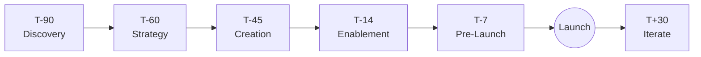
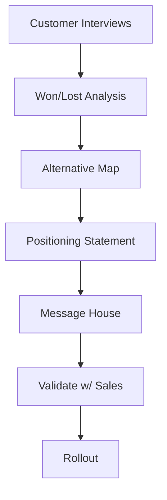
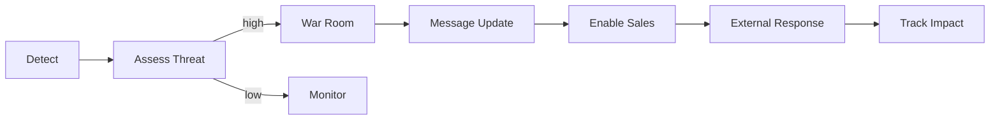
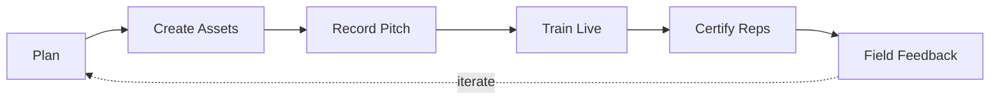
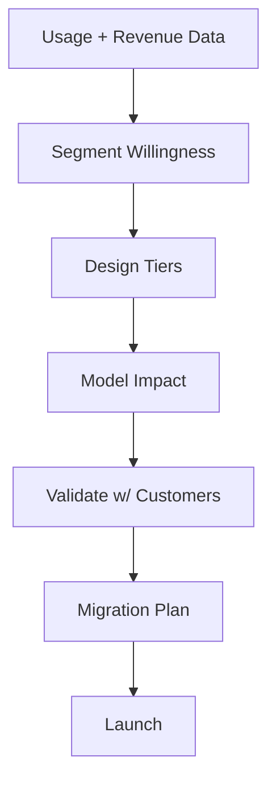

# Product Marketing Playbook

> [!QUOTE] **The Creed**
> *Positioning isn't a deck. It's the sentence the market finishes for us.*

---

## 🧭 When to use this playbook

| Scenario | Trigger | Start with |
|----------|---------|------------|
| New product or major feature launching | 90 days to launch | Play: *The Launch Machine* |
| Sales win-rate slipping | QoQ drop, lost-deal signal | Play: *The Positioning Sprint* |
| Competitor moves | New entrant, pricing shift, narrative attack | Play: *The Competitive Response* |
| Sales team needs enablement | New pitch, new segment, new objection | Play: *The Enablement Drop* |
| Pricing or packaging change | Revenue model pivot | Play: *The Packaging Reset* |

---

## 🎯 Core Principles

1. **Positioning is a promise we can keep.** If the product can't deliver, the pitch is a liability.
2. **The customer says it better than we do.** Interviews > internal wordsmithing.
3. **One message, many volumes.** The same idea compresses into a billboard, expands into a whitepaper, lives in every channel.
4. **Launches are programs, not moments.** The day is the smallest part of the plan.
5. **Sales is our first audience.** If reps can't repeat the pitch in their own words, we haven't finished.
6. **Differentiation is a behavior, not a slogan.** We show, then we tell.
7. **Every launch feeds the next.** Post-mortems are compounding assets, not closing rituals.

---

## 🛠️ The Plays

### Play 1 — The Launch Machine

**When to use:** Any product, feature, or packaging launch material enough to warrant coordinated spend.

1. Discovery: [[Product-Marketing-Manager]] runs 10+ customer conversations, audits competitors, builds the buyer matrix.
2. Strategy: positioning, messaging hierarchy, target segments, success metrics.
3. Creation: landing pages, demo, sales deck, content pillars, paid creative.
4. Enablement: brief sales, CS, and partners; record the pitch; rehearse objections.
5. Pre-launch: seed analysts, creators, and friendly media; run teaser drops.
6. Launch day: coordinated multi-channel drop per [[Workflows#Product Launch GTM]].
7. T+30: performance review, messaging iteration, scale or pivot decision.

Reference: [[templates/Launch-GTM-Plan]].
**Success metric:** Launch KPIs hit (volume, activation, pipeline); sales self-reported confidence ≥ 8/10.

---

### Play 2 — The Positioning Sprint

**When to use:** Win-rate drops, pitch feels flat, or new category emerges.

1. Interview 8–12 recent wins and losses; look for pattern, not anecdote.
2. Map alternatives — not just competitors, but status quo and workarounds.
3. Draft a positioning statement: for whom, against what, unique because.
4. Build the message house: core promise, 3 pillars, 9 proof points.
5. Validate with five AEs and three customers before locking.
6. Rollout through enablement, web, sales assets, and content pillars.
7. Measure win-rate and deal velocity at 60 and 120 days.

Reference: [[templates/Launch-GTM-Plan]] (positioning section).
**Success metric:** Win-rate lift and ACV stability. See [[KPIs#Revenue & ROI]].

---

### Play 3 — The Competitive Response

**When to use:** Competitor launch, pricing move, or narrative attack within 14 days.

1. [[Product-Marketing-Manager]] triages within 24 hours: is this a threat, a distraction, or a gift?
2. If threat: convene a war room with [[VP-Product-Marketing]], Sales, Product. See [[Rituals#War Room]].
3. Decide posture: ignore, reframe, counter, or absorb.
4. Update battlecards and objection handlers within 48 hours.
5. Brief sales leadership; record updated talk track.
6. Public response only when warranted — silence is often stronger than engagement.
7. Track deal-level impact for 60 days.

Reference: [[templates/Crisis-Response-Statement]] (for public-facing replies).
**Success metric:** Win-rate in competitive deals holds or improves within 60 days.

---

### Play 4 — The Enablement Drop

**When to use:** New product, new segment, new objection, or on quarterly cadence.

1. Identify the gap: lost deals, call listens, rep interviews.
2. Build the kit: one-pager, demo script, objection handler, email templates.
3. Record a 15-minute pitch walkthrough — the "canonical" version.
4. Run a live training with role-play; no death-by-deck.
5. Certify reps — they pitch back, not listen.
6. Collect field feedback for 30 days; iterate.
7. Archive the kit in the sales library with a version and owner.

**Success metric:** Rep certification rate ≥ 90%; pitch-consistency audit ≥ 80%.

---

### Play 5 — The Packaging Reset

**When to use:** Pricing model change, plan consolidation, or margin pressure.

1. Pull usage, revenue, and churn data with [[Head-Analytics-Data]].
2. Segment willingness-to-pay with customer interviews and conjoint.
3. Design tiers around job-to-be-done, not feature lists.
4. Model revenue, churn, and expansion impact; stress-test edge cases.
5. Validate with 10 customers across segments before locking.
6. Plan migration: grandfathering, comms sequence, sales playbook.
7. Launch with clear rationale — customers forgive change they understand.

Reference: [[templates/Launch-GTM-Plan]].
**Success metric:** Net revenue retention holds; ARPU moves in the intended direction.

---

## ⚠️ Anti-Patterns

> [!WARNING] **How product marketing fails**
> - *Positioning written in a conference room.* No customer voice = no resonance.
> - *Launch = launch day.* The announcement replaces the program; momentum dies by week two.
> - *Enablement as a deck drop.* Reps read it once, never open it again, pitch their own version.
> - *Feature marketing over problem marketing.* Buyers don't buy features; they buy outcomes.
> - *Competitor obsession.* We spend more time talking about them than about the customer.
> - *No post-mortem.* Each launch is a first launch; lessons never compound.

---

## 📊 Success Metrics

| Metric | Category | Target signal |
|--------|----------|---------------|
| Launch pipeline contribution | [[KPIs#Revenue & ROI]] | Hits or exceeds launch target |
| Activation rate (launch) | [[KPIs#Acquisition]] | Above baseline within 30 days |
| Sales win-rate | [[KPIs#Revenue & ROI]] | Flat or up QoQ |
| Competitive win-rate | [[KPIs#Revenue & ROI]] | Above portfolio baseline |
| Time-to-ramp (new rep) | [[KPIs#Operations]] | Trending down |
| Message-consistency audit | [[KPIs#Brand]] | ≥ 80% |

---

## 🔗 Related

- **Roles:** [[CMO]] · [[VP-Product-Marketing]] · [[Product-Marketing-Manager]] · [[Event-Field-Marketing-Manager]] · [[Brand-Manager]] · [[Head-Digital-Marketing]] · [[PR-Communications-Director]]
- **Workflows:** [[Workflows#Product Launch GTM]] · [[Workflows#Campaign Launch]] · [[Workflows#Brand Approval]]
- **Rituals:** [[Rituals#Weekly Standup]] · [[Rituals#War Room]] · [[Rituals#Retro]] · [[Rituals#Quarterly Business Review]]
- **Decisions:** [[Decisions#Campaign Go / No-Go]] · [[Decisions#Creative Concept Approval]]
- **Templates:** [[templates/Launch-GTM-Plan]] · [[templates/Campaign-Brief]] · [[templates/Creative-Brief]] · [[templates/Crisis-Response-Statement]] · [[templates/Post-Mortem]]
